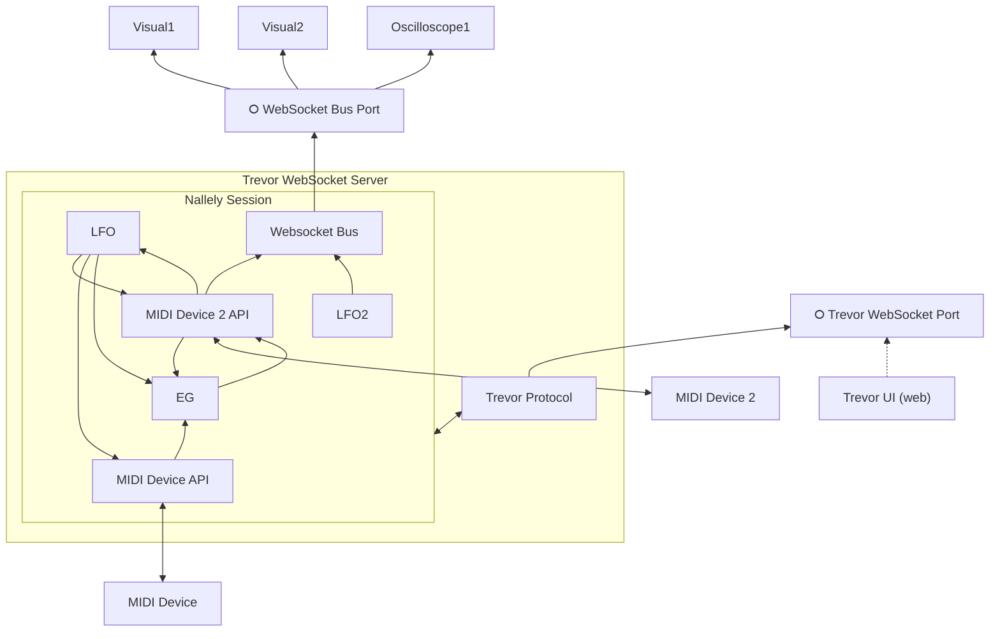

# Nallely-midi, an organic platform for experimentations around MIDI

Nallely (pronounced "Nayeli") is an organic platform for experimentation around the idea of MIDI meta-synth for live coding, generative music, and multimodal art, built for hacker/musicians, inspired by Smalltalk. Nallely is a MIDI companion to help you easily map MIDI controllers/instruments together, as well as create/use virtual devices (LFOs, EGs), compose them, and the possibility to expose/create remote services with parameters on which you can map your MIDI controllers/instruments or virtual devices.

Think about Nallely as a small brain, where each device is a neurone (nothing related to AI) that received signals and emit signals. All those small neurons can connects to each other in various ways. Connecting neurons as you want, you might connect some that in a normal running brain would not communicate, a little bit as if you had a brain under psychedelic influences, mapped in an unusual way, producing unexpected results. Some dedicated neurons (MIDI devices) are abstraction of the physical world and can create sound physically using a MIDI device (the voice), or get impulses from external MIDI devices, while visuals could be seen as visual mental imageries, influenced by how the small neurons are connected. Soon modules to introduce impluses from webcam and audio will arrive, giving this small muscial brain the capacity to see and hear.

Features:
* programmatic seemless API to your MIDI Device,
* virtual devices (LFOs for example) you can connect to your MIDI devices (as source or target),
* introspective API for auto-adaptive virtual modules,
* links are formally defined and are entities of the domain,
* bouncy links: links can trigger target port associated link to have reaction chains,
* Python API code generator for your device if it is listed by the [MIDI CC & NRPN database](https://github.com/pencilresearch/midi) project, or from a YAML description you can easily write (see `configs` folder for examples)
* bind/unbind control/pad/key of your MIDI devices between each other or virtual devices, converting the CC between source and target if required,
* bind/unbind the velocity of the pad/key of your MIDI devices to any CC control,
* bind/unbind pad/key individualy to any control, note, parameter of MIDI devices or virtual devices,
* bind/unbind a key/pad to another one (even if not the same note, you can map a note to its octave on the same device or another one),
* scaler for the values that goes from a source to a target: you can restrict the range of values that will be sent to the target,
* auto-scaling: if you want the source to adapt to the range of the target without setting the range yourself,
* websocket-based bus on which external services can auto-register and expose parameters to which you can bind your MIDI/virtual devices in a seemless way,
* LFOs composition with mathematical expressions,
* Envelope Generator,
* a web interface relying on a websocket protocol (named Trevor) which allows you to do graphically what you would ask Nallely to do in normal time (map devices, parameters, scalers),
* interactive code playground in the browser (through Trevor UI) inspired by Smalltalk playground,
* small web-based widget oscilloscope integrated in the web interface,
* save/reload preset for any MIDI device,
* save/reload patch for full connection between MIDI devices and virtual devices,
* random preset generator for MIDI devices and virtual devices,
* full random patch generator (basic at the moment) with auto-generative capacity as virtual device (you can control it from MIDI devices or other virtual devices),
* possibility to send and broadcast messages and information from the external services,
* (currently disabled) _bind/unbind any Python function to any control/pad/key of your MIDI Device_,

Planned:
* handle multiple banks per device/per section,
* scaler that explicitally maps (vs implicit as right now) to a list of elements, or to true/false (boolean scaler), useful for external services,
* program change support for devices that do not support them (to change banks for example),
* some new virtual devices:
  * arpegiator
  * sequencer

## Architecture and Quickstart

Nallely and Trevor is based on a simple classical decoupled architecture:

* Nallely defines a kind of small object model (devices, parameters, links between parameters and their semantic) relying on threads (1 instance of device by thread), and message sending between them (signal sent from a device parameter to another),
* Trevor defines the protocol to manipulate Nallely "from the outside", and exposes this API programmatically and through a websocket server.
* Trevor-UI defines a web-UI that communicates with a running Nallely's session through the Trevor Websocket Server.

The following diagram shows a kind of instance of what a Nallely's session can look like.



A Nallely's session is made of a set of Virtual Devices instances (LFOs, EG, Harmonizer, etc), and MIDI Device instances that connects to physical MIDI devices through a dedicated API.
The API can be written manually or generated from a YAML decription.
In a session, virtual devices and MIDI devices exposes parameters which can all be patched. Consequently, you can have a LFO that controls the speed of another one, and the output of this modulated LFO can modulate another one. All devices inside a Nallely session are patchable: you can also patch parameter inside a same device. Consequently, you can have a parameter of your MIDI device that contols multiple parameters of other MIDI devices, or even parameter of the same MIDI device (e.g: the cutoff that controls also the resonance in an inverted fashion, or on a dedicated small range only).
A websocket bus, also a virtual device, hence patchable, allows visuals and external application to register to it, exposing their ports. Once their ports are exposed on the bus, any MIDI or virtual device inside the Nallely's session can connect to them and control them.


### Quick Installation

This repository proposes pre-compiled binaries that can directly be downloaded from the `Release` section in this repository. Those binaries are built from the repository by Github action. The binaries are produced by `pyinstaller` and embedd Nallely and Trevor, that can be ran from the command line, as well as Trevor-UI and visuals that can be accessed directly from your local web-browser.

1. Download the archive related to your OS. Please, note that the binary for MacOS and Windows have been built, but not tested as I don't have machines with those OS right now.
2. Unzip the archive, you should have a single binary file: Nallely with Trevor.
3. Run Nallely: `nallely run --with-trevor --serve-ui`. If you want to have the builtins MIDI devices API loaded add the option `-b`.

Once you have Nallely running, you should see a prompt. Pressing `enter` will display information about the running Nallely's session. Typing `q` shutsdown the session, `?` displays the help menu.
As Nallely have been run with Trevor and serves the UI, you can directly go to [http://localhost:3000](http://localhost:3000) or [http://127.0.0.1:3000](http://127.0.0.1:3000) which will serve Trevor-UI. The UI should connect directly to the Trevor Websocket Server.
All the embedded visuals are available at [http://localhost:3000/visuals](http://localhost:3000/visuals). You can open them, and to manipulate them from Nallely and Trevor-UI, you need first to create a `WebsocketBus` in Nallely. You can do that by opening the dropdown menu of the middle vertical rack in the UI and clicking on `WebsocketBus` (currently we are limited to 1 bus, but many different visuals can register to a same bus).

##### Extra Virtual Devices

This repository proposes some extra virtual devices in the `experimental` packaged which are not yet embedded in Nallely as they are not yet "good enough". You can activate them by running Nallely with the `--experimental`:

```
nallely run --with-trevor --serve-ui -b --experimental
```
This will start a Nallely session running Trevor including the default builtins MIDI devices - Korg Minilogue, and Korg NTS-1 (option `-b`) and loads some experimental virtual devices that are not yet in Nallely's core: a pitch shifter, an harmonizer and a virtual device that lets you dispatch an input on multiple outputs, keeping track of the allocated outputs already, transforming for example 2 monophonic synths in a 2 voice polyphonic synth, and highly unstable meta-virtual devices that can generate random patches and create random virtual modules instances.
You can then navigate to [http://localhost:3000](http://localhost:3000) or [http://127.0.0.1:3000](http://127.0.0.1:3000), you should see the virtual devices in the drop-down menu of the middle vertical rack.

## Documentation

A first draft about how Nallely can help you declare your devices and map them using the current API can be find in the [documentation](./docs/main.md). The documentation has not been updated with the latest capabilities of the API, but it should be retrocompatible, unless I really missed something.


## Trevor, Nallely's companion

Trevor is a communication protocol and a UI made to communicate with Nallely through websocket and ask Nallely to create device instance, map devices together or apply scaler. Trevor proposes a web UI that lets you bind everything at run time, without any need for stopping/starting again scripts, as well as an interactive code playground inspired by Smalltalk playgrounds that let's you code/script on the fly.
Trevor runs in two parts: the websocket server (the backend), and the frontend. The frontend is merly just a representation of the state given by the backend, it holds no important state and always render what the backend sends. This means that Trevor-UI is a web interface, but any UI that connects to this websocket, renders the received state and sends commands that complies with the Trevor API (to be documented), it's possible to have another type of UI. There is no limit, Trevor-UI is a simple UI, but other UIs focusing on new interactions and other representation will be developed in the future.

### Local Dev Installation

 In dev mode, or pure local mode, you can run Trevor-UI this way: the web UI is built with vite, react, and uses yarn. We consider here that you have all of this installed already. To install Trevor:

```
cd trevor
yarn install
```

Then to launch everything:

```
# in 1 terminal, inside of the "trevor" directory
yarn dev

# in another terminal, there is various other options you can pass, try --help to see all of them
nallely run --with-trevor
```

### Screenshots/videos of Trevor UI


https://github.com/user-attachments/assets/fb94513a-bee0-442a-b809-fc60ed7c3ab2

### Screenshots of Trevor UI (old)


## Launch the example

This repo comes with one example of a spiral that is controlled by LFOs created by Nallely. To launch it, once you have installed Nallely or downloaded the

There is 4 ways of launching the demo:

1. either  using the Nallely binary you can download from the release section,
3. launching the `visual-spiral.py` script if you have Python installed on your machine and Nallely installed as library (pip installed),
5. loading the `visual-spiral.nly` patch through the UI,
6. loading by a script the `visual-spiral.nly` patch.

We will demonstrate here the three first ways: using the `visual-spiral.py` script, using the downloaded binary, and using the UI.

### Using the downloaded binary

Once you have the binary download, you can run any python script that relies on Nallely's internal API without the need of Trevor. This is handy when you need to have simple scripts, but not to load Trevor, and without using the UI.

1. Simply copy those files from this repository:
  * `visual-spiral.py` => core system for this small example, creates 2 LFOs, waits for external modules (spiral and possibly terminal-based oscilloscope) to connect and maps all together,
  * `spiral.hml` => simple three.js spiral controlled by some parameters,
2. Launch `nallely run -i visual-spiral.py`,
3. Open `spiral.html` in your browser,
4. ...
5. Profit


### Using the Python script

This way of doing relies on the assumption that you have Python installed on your machine and Nallely installed through `pip install` (see section below)

1. Simply copy those file from this repository:
   * `visual-spiral.py` => core system for this small example, creates 2 LFOs, waits for external modules (spiral and possibly terminal-based oscilloscope) to connect and maps all together,
   * `spiral.hml` => simple three.js spiral controlled by some parameters,
   * `external_scope.py` => simple terminal-based oscilloscope relying on `plotext` (optional).
2. Launch `python -m http.server 8000` in the project repository and go with your browser to [http://localhost:8000/spiral.html](http://localhost:8000/spiral.html),
3. Launch `visual-spiral.py`
4. ...
5. Profit
6. (Optional) if you want to see the LFO shape, launch `external-scope.py` from another terminal.

The screenshot below shows you what the result looks like with everything launched


### Using Trevor UI

https://github.com/user-attachments/assets/6913a9be-e4d8-4bb6-b604-5734ce9b6d15


## Other quick examples using Nallely's internal API

Here is a simple example about how to map the cutoff of the KORG NTS-1 with the cutoff of the KORG Minilogue, in an inverse fashion:

```python
import nallely
from nallely.devices import NTS1, Minilogue

nts1 = NTS1()
minilogue = Minilogue()

try:
  nts1.filter.cutoff = minilogue.filter.cutoff.scale(127, 0)

  input("Press enter to stop...")
finally:
  nallely.stop_all_connected_devices()
```

Another example is how to bind the velocity of a pad of the Akai MPD32 to the cutoff of the Minilogue:

```python
import nallely
from nallely.devices import MPD32, Minilogue

mpd32 = MPD32()
minilogue = Minilogue()

try:
  minilogue.filter.cutoff = mpd32.pads[36].velocity

  input("Press enter to stop...")
finally:
  nallely.stop_all_connected_devices()
```

Another more complex example where we create a simple harmonizer for the Minilogue, where the NTS-1 is also playing the harmonized note:

```python
import nallely
from nallely.devices import NTS1, Minilogue

scale = [0, 2, 2, 1, 2, 2, 2]  # major scale
intervals = [4, 3, 3, 4, 4, 3, 3]  # 3rd intervals
nts1 = NTS1()
minilogue = Minilogue()

try:
  for root_note in range(0, 127, 12):  # We start on lower C key and iterate on each octaves
    note = root_note
    for config in zip(scale, intervals):
        offset, interval = config
        note += offset  # we compute the next note of the scale from the root
        new_note = note + interval  # we add the corresponding interval
        if new_note > 127:  # if the result goes over 127, no need to map
            break

        # here is the important part
        minilogue.keys[new_note] = minilogue.keys[note]  # we map the key to the 3rd on the minilogue
        nts1.keys[new_note] = minilogue.keys[note]  #  we map the key to the 3rd on the NTS-1
  input("Press enter to stop...")
finally:
  nallely.stop_all_connected_devices()
```

This is one way of creating a harmonizer, there is a more direct way that you can find in the `nallely.experimental` package.

## Requirements and how to install

The current version requires Python >= 3.10. The library relies mainly on `mido` and `python-rtmidi`, so your system needs to support them.

### Local Installation from sources

There is currently no pypi package for it, so the easiest way to install the library is to:

1. create a virtual env
2. `pip install git+https://github.com/dr-schlange/nallely-midi.git`

### Usage

Nallely's scripts are pure Python script and can be launched on their own, but to simplify the integration with Trevor (protocol/UI), or to avoid to have to write the `try/finally/input`, or to generate the Python API from a CSV or a YAML file configuration, there is a convenient command line interface.

```
$ nallely -h
usage: nallely [-h] {run,generate} ...

Playground for MIDI instruments that let's you focus on your device, not the exchanged MIDI messages

positional arguments:
  {run,generate}
    run           Run scripts and Trevor (protocol for remote control)
    generate      Generate a Python API for a MIDI device

options:
  -h, --help      show this help message and exit
```

#### Run a script or Trevor

The command line let's you either run a simple script (an "init scrip"), launch Trevor websocket server to connect later Trevor's UI, to include paths where you might have API for devices, or include the builtins device config (Korg NTS-1, Korg Minilogue).

```
$ nallely run -h
usage: nallely run [-h] [-l [LIBS ...]] [--with-trevor] [--serve-ui] [-b] [--experimental] [-i INIT_SCRIPT]

options:
  -h, --help            show this help message and exit
  -l, --libs [LIBS ...]
                        Includes one or more paths (file or directory) where to look for MIDI devices API (includes those paths to Python's lib paths).
                        The current working directory is always added, even if this option is not used. The paths that are Python files will be
                        automatically imported.
  --with-trevor         Launches the Trevor protocol/websocket server
  --serve-ui            Serves Trevor-UI, and makes it accessible from your browser. This option is only activated if '--with-trevor' is used.
  -b, --builtin-devices
                        Loads builtin MIDI devices (Korg NTS1, Korg Minilogue)
  --experimental        Loads experimental virtuals devices
  -i, --init INIT_SCRIPT
                        Path towards an init script to launch. If used with "--with-trevor", the script will be launched *before* Trevor is started.
```

#### Generates a Python API for a MIDI device from a CSV or YAML configuration

If you have your MIDI device [listed in this repository](https://github.com/pencilresearch/midi) as CSV, or a YAML description of your MIDI device, you can generate the Python API for it to be integrable with Nallely.

```
$ nallely generate -h
usage: nallely generate [-h] -i INPUT -o OUTPUT

options:
  -h, --help           show this help message and exit
  -i, --input INPUT    Path to input CSV or YAML file
  -o, --output OUTPUT  Path to the file that will be generated
```

NOTE: If a CSV configuration is given as input, the equivalent YAML configuration will be generated at the same time.
Also, as you can see, there is no special mention of key/pads section in the CSV configuration available in the https://github.com/pencilresearch/midi repository.
If you want to generate a key section for your device, you can modify the YAML configuration by adding a `xxx: 'keys_or_pads'` entry. Here is how it's done for the Korg NTS-1:

```
KORG:
  NTS-1:
    # ... Other sections here
    keys:
      notes: 'keys_or_pads'
```

The `xxx: 'keys_or_pads'` entry doesn't have to be in an isolated section, it can be set with other sections, but it's only possible to have one `key_or_pads` entry by section.


## Install Nallely and Trevor on a Raspberry Pi

Nallely and Trevor works perfectly fine on raspberry pi, meaning that you can bring them with you, connect all your synth to the RPI and enjoy your organic meta-synth system everywhere with you.
The configuration is currently still very manual (systemd service creation, etc), but will be made automatic later.

TO WRITE


## Fonts used

Nallely includes several retro Amiga-style fonts from the [rewtnull/amigafonts](https://github.com/rewtnull/amigafonts) project.

These fonts are licensed under the GNU GPL with the Font Exception, which allows them to be used and embedded in this BSD-licensed project without imposing copyleft requirements.

See [`trevor/public/fonts/LICENSE.amigafonts`](trevor/public/fonts/LICENSE.amigafonts) for full license and attributions.
