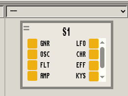

<!-- BEGIN ARISE ------------------------------
Title:: "How to make Nallely understand new MIDI devices"

Author:: "Dr. Schlange"
Description:: "How to add a new MIDI device in Nallely"
Language:: "en"
Published Date:: "2025-07-10"
Modified Date:: "2025-07-10"

---- END ARISE \\ DO NOT MODIFY THIS LINE ---->

# How to add a new MIDI device in Nallely

By default, Nallely understands three MIDI devices as builtins:

* Korg NTS-1,
* Korg Minilogue,
* Akai MPD32 (specific configuration).

This doesn't mean that Nallely cannot understand other MIDI devices, it just means that we need to manually add new MIDI devices to Nallely. Nallely works by reflecting on an abstraction of the MIDI device through a reflexive Python API that is dedicated to each MIDI device. The Python API is described using an internal Python DSL that allows you to declare in a simple way the MIDI device. So, to make a new MIDI device understood by Nallely, we need to produce this Python API. There is basically 3 ways of doing it by:

1. generating the Python API using Nallely from a YAML description,
2. generating the Python API using Nallely from a CSV description coming from the [MIDI CC & NRPN database](https://midi.guide/),
3. writing the Python API by hand.

In this article, we will make Nallely understand the Roland S-1 mini synth, by reviewing the three methods so you can decide which one fits you the best. For each method we show a brief overview of the process - "from a file to a living neuron in Nallely" - we then show the specific syntax involved in the form of a small tutorial. We finally reflect on the key points related to each method.

**NOTE**: Among the three methods, there is no "best method". Each of them is valid, it's just a matter of taste, but the one that generates the Python API code from the CSV provided by the `MIDI CC & NRPN database` might require a little bit of attention as - despite the efforts made by the authors to harmonize the descriptions - some CSV descriptions are not entirely well formed.

**Limitations**: the current version of the Python internal DSL for describing MIDI devices supports LSB CC description, keyboard, and pitchwheel. Currently MSB CC and sysex messages are not supported, but they will in future version. More importantly, the Python internal DSL to describe MIDI devices will always be retro compatible. If for some reasons in the future the internal DSL changes, automatic converters will be provided (it should be only a matter of doing AST transformation, so not a big deal).

## Generate the Python API from a YAML description

This method is perhaps the simplest in the sense that you just have to write a YAML file, by referring to the MIDI implementation chart of your device. In this section we focus on the Roland S-1. We first describe the process at coarse granularity, then we write a first incomplete version that we directly integrate into Nallely, then we iterate on our first version to get the full MIDI device's Python API automatically generated. Finally, we conclude over this methods, the gotchas and important points to consider.

### Process overview

This method considers as entry point a YAML description. This description is the main and only artifact that needs to be written by hand. This YAML description is then fed to the API code generator provided by Nallely, which will produce the Python API in a dedicated Python module which can be directly added to a Nallely session.

```markdown
YAML file --(nallely generate)--> dedicated Python API
```

If some adjustments needs to be done later, the generated Python module shouldn't be modified by hand, only the YAML description should, then the code have to be generated again using Nallely.

#### YAML format understood by Nallely

Nallely uses a specific structured format for the YAML description as we can see in the following snippet.

```yaml
manufacturer name:
    MIDI device name:
        section 1:
            parameter name:
                cc:
                description:
                min:
                max:
                init:
```

The `manufacturer name` is the name of the company that built the device. This entry is currently not really used, but will be in the future. It will help to sort various devices, and search them by manufacturer/brand name (for example). If you have multiple devices of this brand, it's better to use the same name each time, just for harmony purpose.

As sub-section of the `manufacturer name`, we have the device name. This information is used in the generated code to try to automatically connect the device to a MIDI I/O port. To choose this name properly, if you use MIDI-USB, the best is to check the device name when connected to you machine and use a fragment of this name as the `device name`.

When you have described the `manufacturer name` and the `device name`, then you can add multiple sections. In each section, you can add multiple `parameter names` configured by:

* their CC number,
* their min and max value (*optional*, default values are `0` for `min` and and `127` for `max`),
* their init value (*optional*, which represent the value of this parameter when the unit is freshly powered. Default value is `0`)
* their description (*optional*).

Some of those configurations entry are optional, the only important mandatory one is the `CC` number. The other can be omitted if they are not different from the default values.

### A first version for the Roland S-1

When we write a new YAML description (configuration), we need to have the MIDI implementation chart. This is something that is provided by all manufacturer about their product (if the device supports MIDI, obviously). For the Roland S-1, we can find the implementation chart [here in html](https://static.roland.com/manuals/s-1_manual_v102/eng/87294690.html) in their website for version `1.02` of the firmware.

Now that we have a implementation chart, we need to read it a little bit to check how it's structured and to decide what are the different sections that we should add. All MIDI implementation charts are not structured the same, some already have sections for the parameters, others no (usually they don't), so it's your responsibility to decide in which section you want to sort your parameters and how you want to name them.

In the implementation chart for the S-1, we can quickly identify at least a section for the oscillators. For a first version, we will then only add two sections: one for the oscillators, and a section that is never explicitly added in those charts (as it is implicit) the keys/pads section.

Here is a first small version of the YAML and description for Roland S-1 which describe 2 parameters for the `oscillators` section and the keyboard and the pitchwheel for the `keys` implicit section:

```yaml
Roland:
  S-1:
    oscillators:
      ᴧ_level:
        cc: 19
      ꟺ_level:
        cc: 20
    keys:
      notes: "keys_or_pads"
      pitchwheel: "pitchwheel"
```

As you probably notice, the parameters in the `keys` section are a little bit special. The `notes` parameter is not defined by a `cc`, but is defined by `"keys_or_pads`", and `pitchwheel` is defined by `"pitchwheel"`. These are specific parameters. Nallely will know how to generate the right code for the keys to let you patch later either the full keyboard, or specific keys. The pitchwheel will be generated as a special element also, to let you patch the pitchwheel. Those are necessary as, under the hood they imply:

* different MIDI messages that need to be sent to the MIDI device,
* different hooks that needs to be injected in the interruption table,
* a specific callback compilation at run time when those ports are patched with any other kind of ports (CC/keys/key/pitchwheel/virtual paramters, for curious people, check the [callback generation code](https://github.com/dr-schlange/nallely-midi/blob/main/nallely/core/links.py)).

Now that we have a first version, even minimal, we can generate the code using Nallely and we can directly add it to a Nallely session:

```markdown
# generate the API in s1.py
nallely generate -i s1.yaml -o s1.py
# add it to a new session
nallely run --with-trevor --serve-ui -l s1.py
```

That's it, the device is now here and working, we can start to use it, patch it with virtual devices, and patch it with other MIDI devices.


The `nallely generate` sub-command takes 2 parameters: `-i` to specify the path towards the YAML configuration file, and `-o` to specify the path towards the Python API module that will be generated.
The `nallely run` sub-commands specify here that we want Trevor to be activated to make the session remotly modifiable at run time, and directly served from Nallely (it could be served from another source).

### Extending the configuration for the S-1

Now that we have the base, we can iterate on the implementation chart and add the missing sections:

```yaml
Roland:
  S1:
    general:
      pan: { cc: 10 }
      poly_mode: { cc: 80 }
      # ... other parameters
    oscillator:
      ᴧ_level: { cc: 19 }
      ꟺ_level: { cc: 20 }
      # ... other parameters
    filter:
      frequency: { cc: 74 }
      resonance: { cc: 71 }
      # ... other parameters
    amp:
      amp_envelope_mode_sw: { cc: 28 }
    env:
      attack: { cc: 73 }
      decay: { cc: 75 }
      # ... other parameters
    lfo:
      key_trigger: { cc: 105 }
      mode: { cc: 79 }
      # ... other parameters
    chord:
      voice_2_sw: { cc: 81 }
      voice_2_key_shift: { cc: 85 }
      # ... other parameters
    effects:
      reverb_level: { cc: 91 }
      reverb_time: { cc: 89 }
      # ... other parameters
    keys:
      notes: "keys_or_pads"
      pitchwheel: "pitchwheel"
      # ... other parameters
```

Once we have everything, we generate the new Python API and we can include it in a Nallely session as we did earlier:

```markdown
nallely generate -i s1.yaml -o s1.py # generate the API in s1.py
nallely run --with-trevor --serve-ui -l s1.py # add it to a new session
```



**NOTE**: You can find the full configuration (and some others) [here](https://github.com/dr-schlange/nallely-midi/tree/main/configs) in YAML format and the generated Python module.

### Conclusion, gotchas

This method is by far the simplest, even if - we have to be honest - a little bit tedious. The YAML syntax is not complex to write, but the fact that we need to go through the MIDI implementation chart, decide in which section we want to put the parameters and write them is what I consider tedious. Copy/paste make it easier to add new parameters, but it's also error prone. That probably something that we could improve trying to [generate automatically the YAML file from the MIDI implementation chart](#generating-it-from-midi-implementation-chart) provided by the manufacturer, but that's something that is not easy to do.


## Generate the Python API from a CSV description

This way of generating the Python API uses existing kind of harmonized description of MIDI devices from the [MIDI CC & NRPN database](https://midi.guide/) initiative. Even if that solution looks simpler as we don't have to manually describe the parameter names and their associated CCs, we show in this section that, unfortunately, the format for the MIDI device description is not always the same.

**NOTE**: an in-depth explanation of this method is available from [Nallely's documentation](https://github.com/dr-schlange/nallely-midi/blob/main/docs/main.md#generating-a-new-configuration-for-a-device).


### Process overview

The process considers an already CSV file as input (or your own manually crafted CSV file if you want, that you could derive from a xlsx sheet). The CSV is passed as input of the Nallely's generator, and the corresponding Python API module is generated, as well as the YAML description in the format previously described.

```markdown
CSV file --(nallely generate)--> dedicated Python API
                             +-> YAML description file
```

If some adjustments needs to be done, the generated Python module shouldn't be modified by hand, the YAML or CSV description should. Then the code is generated again using Nallely. You have the choice to modify either the CSV description, or the YAML one, but I would strongly recommend to use the YAML description, it's by far easier to modify than the CSV (personal opinion of course).

### From a well formatted CSV

If we have a well formated CSV, as the one for the [Korg NTS-1](https://midi.guide/d/korg/nts-1/) or [Korg Minilogue](https://midi.guide/d/korg/minilogue/), then life is easy. We just download the corresponding CSV file, then we generate the code, *et voilà*, we can include it in a Nallely session:

```markdown
nallely generate -i nts1.csv -o nts1.py
nallely run --with-trevor --serve-ui -l nts1.py
```

If you load this freshly generated module in a session, you'll see however that there is a small catch: there is no `keys` section. This is due to the fact that the CSV description doesn't embed a specific section or marker to describe the keys and the pitchwheel (which makes totally sense). Consequently, if we want to have this section, we have to modify the YAML description that was generated from the initial CSV and to add the missing section as we did previously in this article. Once we added the missing section, we can, once again, generate the Python API code from the YAML description, and forget about the CSV as we have the YAML file for further modifications (if needed).

### From a badly formatted CSV

All the problem of this method is really this case... What happens when we have a badly formatted CSV? The [CSV for the Roland S-1](https://midi.guide/d/roland/s-1/) is a good example. It seems that it was directly produced from the html MIDI implementation chart from Roland's website, but it doesn't conform to the [syntax/format recommended by the MIDI CC & NRPN database](https://raw.githubusercontent.com/pencilresearch/midi/main/template.csv).
Let's generate the code and see what's happening:

```markdown
$ nallely generate -i s1.csv -o bads1.py
$ cat bads1.py
""
Generated configuration for the Roland - S-1
"""
import nallely

class All_ccsSection(nallely.Module):
    modulation_wheel = nallely.ModuleParameter(1)
    lfo_rate_(lfo_[rate]_knob) = nallely.ModuleParameter(3)
    # ...
```

... that's not great.. We can see that the name of the class that will represent a section is weird, and that the names of the parameters are sometimes wrong (they have `(` and other special characters).
On another note, we can see also is that the Python API is not that complicated to read or write (beside the parameters name being wrong). We have a `class` that inherits from `nallely.Module`, then class variables that are instances of `nallely.ModuleParameters`. That's it for the basic, and the missing "glue" code is not that much more complicated.

Anyway, what we can see is that the generated code is not right, there is no well defined sections, the parameter names are bad... We definitely cannot use it, and modifying the Python code by hand is definitely not a good option. In this case, there is no other choice than producing the YAML configuration by hand...

### Conclusion, gotchas

This method is a good one when we have the chance to have a well formated CSV. Consequently, before writing a YAML configuration by hand, it's recommended to check on the MIDI CC & NRPN database website if there is a CSV configuration for your device, then if the CSV is well formatted or not. Depending on that, you'll know if you can bootstrap your YAML description from the CSV or if you need to go by hand writing your YAML description.


## Write the Python API by hand

This method is not complicated per say, but it implies to manipulate the internal Python DSL to describe MIDI devices by hand. This method is described in depth in [Nallely's documentation](https://github.com/dr-schlange/nallely-midi/blob/main/docs/main.md#define-a-new-configuration-for-a-device-programmatically), and while it's a perfectly fine method to use, I wouldn't recommend it, just in case the internal DSL moves a lot between versions (even if it should always be retro-compatible).

### Process overview

This method removes the need to generate code from a YAML/CSV description. You basically cut the middle man and just manually describe your MIDI device configuration using the internal Python DSL. As you are directly writing the Python module, you can directly load your code in a Nallely session:

```markdown
Python module file --(manual modification)--> new version of the dedicated Python API
```

### Describing your device

Without entering in too much details (please refer to the in-depth [documentation](https://github.com/dr-schlange/nallely-midi/blob/main/docs/main.md#define-a-new-configuration-for-a-device-programmatically) about this method), basically:

* a device is a class that inherits from `nallely.MidiDevice`;
* sections are classes that inherit from `nallely.Module`;
* parameters are class variables that are instances of `nallely.ModuleParameters`;
* the keyboard is a class variable in a section that is instance of `nallely.ModulePadsOrKeys`;
* the pitchweel is a class variable in a section that is instance of `nallely.ModulePitchwheel`;
* sections are inserted in a device as class variable of the device;
* Python `@property` are used inside the device class as shortcuts toward sections.

If you want to have an overview of how the code is structured, you can check any configuration of the builtins devices inside Nallely or the onces that are are in `configs` folder (e.g: configuration for the [Behringer Pro-VS Mini](https://github.com/dr-schlange/nallely-midi/blob/main/configs/behringer-provs-mini.py)).

### Conclusion, gotchas

This way of doing, while not being complicated, is perhaps the less recommended. The internal Python DSL is not hard to understand and to use, but writing the section shortcut after the `__init__(...)` method is annoying and error-prone. It's definitely better to let that to a code generator.

## What could be improved?

The three described methods are not complicated to deal with, but - in my opinion - they could be improved. I'll be honest, currently, I'm not sure what would be the best way to improve that. Here is some ideas about how they could be, and why, but I'm still not convinced by those methods at the moment.

### Make it interactive?

A good way of dealing with this would be to make the "ingestion" process a little bit more interactive following this process:

1. from the interface a new button let you "aquire" a device;
2. in this mode the interface could ask the user to tweak a button then:
    1. associate it:
       * to a new section
       * associate it a an existing section
    2. name it
3. loop from 2 until there is nothing more to aquire.

Even if this solution might seems interesting, there is - still in my opinion - three major flaws:

1. we need to constantly swap from "tweaking a button" to "typing information using the keyboard" => that's annoying, I don't like that;
2. we need to handle section creations and selection from the interface => there is probably good ways of doing it, but that's not so amazing as we don't have a full global vision of all the parameters, we cannot sort them properly, so we need to be able to add/select/remove sections. Nothing impossible, just, at the end, not that amazing;
3. we need to pass manually through all the CCs and depending on the MIDI device, it might be really tedious, especially for devices that have a lot of menus/sub-menus.

Among those flaws, the biggest annoying part would be the first point: having to pass from tweaking a button, to the keyboard to enter information. We could slick that by letting the user tweak all the buttons at once *then* enter information. Doing this reduces the necessity to switch from one place to the other, but when all the parameters are aquired, it might be really difficult to remember to which parameter was refering a specific CC, and going through all the buttons, depending on the MIDI device, might also be painful.

### Generating it from MIDI implementation chart?

A way to simplify the aquisition of new MIDI devices could be to try to generate the input YAML file directly from the MIDI implementation chart provided by the manufacturer. After all, the MIDI implementation chart is provided and shouldn't contain any error, so it would be easier. That's true, but here is the catch: they don't have all the same format. They have a "somehow" same format, but it's not exactly the same, and it varies a lot depending on the company. As example, just look at some implementation charts made by Roland, and some made by Behringer. While we find the same kind of information inside - more or less - they are structured really differently. Same story if we go to Korg: a somehow equivalent looking implementation chart, but not exactly the same. On top of that, it's not even sure that the implementation charts have the same format between devices of a same brand. That's why the initiative "MIDI CC & NRPN database" initiative is so interesting: they try to harmonize everything. Unfortunately, they sometimes fall short in having everything well formated. I'm not pointing fingers or criticizing, it's a complicated task and it relies a lot on how careful are contributors to match the recommended format.

### Automatic fetch configuration files from a remote DB?

This would be the best: you just search from the command line for your device, then, when you identified it, Nallely automatically downloads the MIDI chart, generates the Python API code and integrates it at run time in the running session. Technically, there is no blocking part, all is easy to do, but the only problem is "where do I find 100% harmonized version of MIDI implementation charts in a format that is easy to parse?". As we saw in this article, there is only one initiative that goes in this direction, but the result highly depends on the CSV description that is not always formatted the same. There is so much variations between configurations that it makes it complicated to consider some general format exceptions, and it's not a good idea to start to have some. Indeed, if we start having some rules exceptions, as those exceptions are "per device" dependent (exactly, per contributor dependent), then we would need to support all small variations. It would be weird to only support some variations, but not all of them... So, at the end, this alternative is not currently viable.