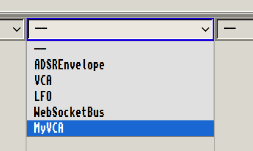
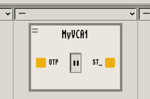
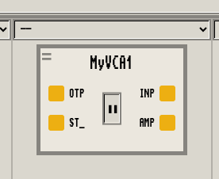
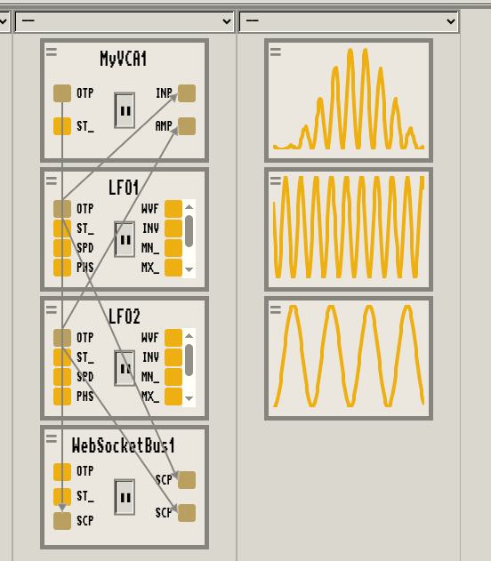

<!-- BEGIN ARISE ------------------------------
Title:: "Let's build a VCA with Nallely"

Author:: "Dr. Schlange"
Description:: "How to build a Voltage Control Amplifier with Nallely from scratch"
Language:: "en"
Published Date:: "2025-06-21"
Modified Date:: "2025-06-21"

---- END ARISE \\ DO NOT MODIFY THIS LINE ---->

# How to build a VCA with Nallely

Lately I'm [refactoring the interal API](https://github.com/dr-schlange/nallely-midi/issues/12) to create virtual devices. I want something that is simple, yet expressive enough to focus on the signal/value computation logics, without bothering so much on keeping track of notes/values to detect edges or increasing values. So, what's better than write a new, very simple, virtual device? This will help to see quickly:

* where are the friction points,
* what's complicated to write,
* what's complicated to conceptually get,
* how we can converge towards the simplest version that do not translate simplicity in loss of flexibility.

What's the simplest module we can write for that? Well, let's build a VCA!

## Why a VCA? What's would be a VCA with Nallely?

In this tutorial/reflection post, we will build a Voltage Control Amplifier (VCA), well, something close to it. The idea behind the VCA is simple: an `input` is fed to the module, then a CV controls the amount of the input signal is sent out of the VCA (the `amplitude`). This kind of devices is simple enough to not consider a lot of routing or computation logic, and will give us exactly what we need to reflect and iterate on the internal API.

So, how do we start, what do we need, what's the dev process here?

## Write code here, launch it like this

Let's prepare our environment to develop our VCA. First, we need to have [Nallely on your system](https://github.com/dr-schlange/nallely-midi?tab=readme-ov-file#quick-installation) and be able to run it.
Once you have that, you can grab your best code editor, with all your favorite Python related plugins, and we are good to go.

First, we will write the virtual device in a separate file, so we create a `vca.py` file somewhere. This is the file that will contain the virtual device (or multiple virtual devices). To load the file in a Nallely session, we just need to run from the command line:

```bash
nallely run --with-trevor --serve-ui -l PATH_TO_YOUR_FILE/vca.py

# if we have vca.py in the same current directory
# we are launching Nallely from
nallely run --with-trevor --serve-ui -l vca.py
```

That's it:

* `nallely run` will launch a Nallely session;
* `--with-trevor` will enable the Trevor protocol/bus (to communicate with a UI);
* `--serve-ui` will serve the Trevor-UI on port `3000` on `localhost` (you could have your own alternative UI as long as it conforms to the Trevor protocol);
* `-l ...` will load the file as a library for Nallely inside the Nallely session.

Running the commands displays:

```sh
Trevor-UI running on http://localhost:3000 or http://127.0.0.1:3000...

Press 'q' to stop the script, press enter to display infos, press ? to display menu...
>
```

Navigating now to `http://localhost:3000`, you should see this

![Empty Nallely session [[open wide]](imgs/00.png)](imgs/00.png)

Now, we need to write the VCA virtual device actual code in `vca.py`. We start with the basic, creating a new class that inherits from the `VirtualDevice` class. Let's call it `MyVCA` so we can differenciate it from the `VCA` virtual device already existing in Nallely.

```python
from nallely import VirtualDevice

class MyVCA(VirtualDevice):
    ...
```

That's it, now your new device will be known in Nallely sessions. Stop the current Nallely session typing `q` then `enter` in the prompt, then launch again `nallely` using the same command line you previously used.
In the UI, once it reconnected to the session (it's automatic, look for the connection indicator in the top-right of the screen), you can select in the dropdown of the virtual device rack the option for the VCA.



When we click on it to add it to the virtual device rack, a `MyVCA` instance is added to the rack, and already has 2 ports, which are the ports that all the virtual devices inherit from `VirtualDevice`. The first one is the default `output`, while the second one is a `set_pause`. It allows us to pause the device when set to `1` (pause the underlying thread). As those ports are visible, they are directly patchable in the system.



We have now all we need to start giving more power and shape to our VCA.


## Adding new ports

We are definitly missing ports and behaviors in our VCA. Currently, we only have the default `output` and the `set_pause`, which are pretty generic, but not related to the VCA. If we read again [what we need](#why-a-vca-whats-would-be-a-vca-with-nallely), we quickly see that we require at least an `input` port and an `amplitude` port. Let's add them to the device.

```python
from nallely import VirtualDevice, VirtualParameter

class MyVCA(VirtualDevice):
    input_cv = VirtualParameter(name="input", range=(0.0, 127.0))
    amplitude_cv = VirtualParameter(name="amplitude", range=(0.0, 1.0))

    @property
    def range(self):
        return (0.0, 127.0)
```

In this snippet, we defined 2 class variables `input_cv` and `amplitude_cv`. They are `VirtualParamter` instances. For each of them, we define the internal `name` of the parameter (port) and the `range` it considers. The "internal" name is a name that is used to access the actual value later, while the name of the class variable, e.g: `input_cv`, is used for patching.
The `range` is not necessary, but it helps to declare what's the best range on which the parameter is operating. This is useful when those ports will be patched. As we declared the range, when a patch is created with this port as target, a scaler is automatically created to indicate that the value that will be sent to the parameter has to be adapted to this range. Also, please note that we used float here. If we use two integers in the ranges, the conversion will automatically consider a rounding as int for the converted value.

So, we set the range for the `input_cv` and `amplitude_cv` port. How do we set the range for the `output_cv` port that is automatically inherited from the `VirtualDevice`? Well, this is done by overriding the `range(...)` property. We set here the output to the `0.0..127.0` range. Why do we choose this range? We could have decided of any range, but 0..127 is practical as it will map well with the range of usually accepted values in MIDI. Obviously, as there is the auto-scaling kicking in, we could have set any other range, but having a large one helps to have a conversion that is a little bit "finer" than if we had declared, for example, `0.0..1.0` as output range.

Let's now restart the Nallely session, and create a new instance.



Those ports are already patchable and understood by Nallely in the session. Let's create an LFO and patch it with our VCA.


We are in good tracks, but there is still something we need to do, we need to setup the initial values for the internal name of the parameters. There is a catch also, due to the nature of the object model of Nallely. Let's add the init values and we discuss after of what's going on.

```python
from nallely import VirtualDevice, VirtualParameter

class MyVCA(VirtualDevice):
    input_cv = VirtualParameter(name="input", range=(0.0, 127.0))
    amplitude_cv = VirtualParameter(name="amplitude", range=(0.0, 1.0))

    @property
    def range(self):
        return (0, 127)

    def __init__(self, **kwargs):
        self.input = 0.0
        self.amplitude = 0.0
        super().__init__(**kwargs)
```

We set `input` and `amplitude` as `0.0`, and, we called the `__init__(...)` method from the super class at the end (here is the catch). Let's break this down.
We consider that `input` has no entry when the instance of our VCA is created and that the `amplitude` will be `0.0` (no amplitude).
If you are curious, [see here why `super` is called at the end of the init method](#why-do-we-super-at-the-end).

Now that we have the port, that would be nice to have the device actually doing something.

## Reacting when receving values on the ports

Currently, instances of the device can be created, and the ports can be patched. All is handled by Nallely and its object model. However, we don't have any behavior right now. What should be done then? We need to consider this logic:

* when a value arrives on the `input`, we multiply it with the current `amplitude`, and we redirect it to the default `output`.

That's pretty much it actually, nothing else. To react to value arriving on parameters/ports, we use the `@on` decorator. This decorator lets you add information to a method to express the fact that this method has to be triggered when the value arrives on a specific port. Talk is cheap, lets see the code.

```python
from nallely import VirtualDevice, VirtualParameter, on

class MyVCA(VirtualDevice):
    input_cv = VirtualParameter(name="input", range=(0.0, 127.0))
    amplitude_cv = VirtualParameter(name="amplitude", range=(0.0, 1.0))

    @property
    def range(self):
        return (0, 127)

    def __init__(self, **kwargs):
        self.input = 0.0
        self.amplitude = 0.0
        super().__init__(**kwargs)

    @on(input_cv, edge="any")
    def handle_input(self, value, ctx):
        return value * self.amplitude
```

The method `handle_input` is decorated by `@on`, attached to `input_cv`. We also wrote that the `edge` that will trigger the method is `any`, meaning that any value arriving, whatever the previous value, will trigger the input. Those methods have to have the signature `self, value, ctx`, where `value` is the value received, and `ctx` is information about the trigger context. In our case, we just need to do this: we need to multiply the input, with the current amplitude, which is done by `value * self.amplitude`. We could also have written it `self.input * self.amplitude` as `value` is just a quick access to `self.input` in this decorated method. The computed value is returned. Returning a value of a trigger method actually sends the value on the default output. There is ways of having finer control over the sent values, but it's for another story.

Now we have a first version of our VCA! We can stop/restart the Nallely session, then create:

* an instance of our VCA;
* an LFO that will drive the amplitude;
* an LFO that will drive the input;
* a Websocket bus to create an oscilloscope and see the output of the VCA;

and we patch everything together. To patch everything, we will use the mobile version, just because why not. Trevor-UI is touch/mobile friendly, so you can drive your full session from your phone or any portable device that has access to the same network than the one where the Nalelly session is running. If you are building or built your patch on another machine, you can still connect from your phone or any other devices, you'll see the patch, the session and you'll be able to interact with it. A running session is shared by all the connected UIs (clients).

)](imgs/05.png)

Here what's happening:

1. LFO1 is sending values to the `input` of our VCA. It's a sine running at a specific frequency;
2. LFO2 is driving the `amplitude` of our VCA. It's a pulse, so when the LFO will switch to the max value, it will be converted to a `1` sent on the `amplitude` of our VCA;
3. Consequently, the VCA is cutting "slices" of the input. So, it's slicing our sine from LFO1, by multiplying the values arriving on `input` by the values that are arriving on `amplitude`.

This multiplication explains also why we don't see a "smooth" sine as slice of LFO1. As the multiplication of the input by the amplitude is performed on float, and that float have a specific precision in Python, well, some values represent bad. When they are transmitted to the frontend, then translated to as a value on the graph of the osciloscope, this value sometimes doesn't perfectly fit a nice increasing or decreasing slope. This is, however, not a huge deal, especially if we use the value to reach a MIDI device. The output of our VCA could drive the notes, or "turn" the buttons (CCs), the pitch wheel of physical synth, and those values will be converted to an integer on the range 0..127. So intermediate "values" (e.g: 50.3567), will be rounded anyway.

Also, it's important to consider that the oscilloscope gives a "rough idea" of the values, but doesn't reflect the actual load of the system. Meaning that even if you can see some "miss" on the oscilloscope, it's probably related to the broadcast of the values to the frontend, which are handled by a separated thread, and not about the values actually produced by the virtual device. Consequently, you can see something that looks a little bit glitchy sometimes, but you'll not "hear it" from your MIDI devices.

Another note: if we really want to cut smooth slices, we could code instead another virtual device that would just let pass the `input` depending on a `gate` without doing any computation. This way, we would ensure that we get a nice sine, or a nice copy of the input values.

## Let's improve things a little bit more

We have our VCA running, but we can improve a little bit how to the virtual device reacts. Currently, the virtual device is receiving values all the time on `input` (as we have a sine, so each value sent to the port is different from the previous one), while it receives only changes of values on `amplitude`. This means that when `amplitude` is `0`, input continues to receive information and performs the computation. The VCA multiplies the input by 0 (the amplitude), and thus produces 0 as output. This is fine, but this implies that the internal queue for our VCA `input` actually receiving values that are "consummed", but that do not do nothing (produces 0). Those values are actually stored in the queue at some point, which is not efficient as we know that we need to start the computation when `amplitude` is > 0. So, instead, we could decide to "close" the `input` port when `amplitude` is switching from a non-zero value to 0 and "open" the `input` port when `amplitude` is switching from 0 to something which is > 0.

There is low level methods on the `VirtualDevice` to do that: `_close_port(...)` and `_open_port(...)`. We will also need to react on rising and falling edges of `amplitude`, using `@on`. Coding this behavior is pretty forward even if there is a small twist.

```python
from nallely import VirtualDevice, VirtualParameter, on

class MyVCA(VirtualDevice):
    input_cv = VirtualParameter(name="input", range=(0, 127))
    amplitude_cv = VirtualParameter(name="amplitude", range=(0.0, 1.0))

    def __init__(self, **kwargs):
        self.input = None
        self.amplitude = 0
        super().__init__(**kwargs)

    def setup(self):
        self._close_port("input")
        return super().setup()

    @on(input_cv, edge="any")
    def sending_modulated_input(self, value, ctx):
        return value * self.amplitude

    @on(amplitude_cv, edge="rising")
    def opening(self, value, ctx):
        self._open_port("input")

    @on(amplitude_cv, edge="falling")
    def closing(self, value, ctx):
        self._close_port("input")
        return 0
```

We have now two new methods `opening` and `closing`, which are reacting to changes on `amplitude_cv`:

* `opening` is reacting on `rising` edges (i.e: that transition from 0);
* `closing` is reacting on `falling` edges (i.e: that transition to 0).

Those method only makes the calls to `_open_port` and `_close_port` to open or close the `input` port. As you can see, we starts with a closed port as the `amplitude` init value is set to 0. You can also see that the initial state for the port wasn't set in `__init__`, but was set in a new `setup(...)` method. This method is called *before* running the main loop method from the thread. We need to initialize our port as "closed" in this method as the `_open_port(...)` and `_close_port(...)` methods are working with some internal instance variables that will be initialized *arfter* the execution of `super().__init__(...)` in the `__init__(...)` method. Let's be honest, that's not great, but that's the way it's done right now.

Now that we have our new VCA, we can try to play a little bit more with it, this time considering a sine entering on `amplitude_cv`.



Where to go from there? Well, you can now use your VCA, connect it to your MIDI devices, to another virtual device, if you have some visuals runnings and register on the Websocket bus, you can drive those and make them come to life. That's your first module, you have now the basics to build your own virtual devices, and a kind of a deeper view of Nallely. So let's start building, make noise and make things move!

## Reflecting on the VCA example

Ok, if you make it until here, you're tough, the article is long and rich (hopefully) in details. We have our own VCA, it's optimised, but what did we learn from this experience? How can I use this information to refine the internal API.

### What's on the right track

Well, we see that it's quite easy to create a virtual device, we only inherits from `VirtualDevice`, and we get for free the handling of the thread, as well as internal queues, a default output, and a patchable way to pause the virtual device.

We saw that we can declaratively defines parameters (ports), by just creating class variables that are `VirtualParameter` instances. That's pretty convenient, they are directly understood by Nallely and integrated in the system.

We also saw that we have some facilities to react on different kind of input values using the `@on` decorator, which helps to not have to deal with some internal logic about remembering old values or triggering only on some conditions. That's enough at the moment, but it could be improved.

### What's ok-ish

The fact of having a different name between the variable name for the class variable that defines the parameter and the "internal" name of the parameter, is not the best, but is ok at the moment. This gives flexibility as it allows us to write `@property` using the internal name, without overriding the class variable name. That's something we can live with, but that could be improved considering a naming convention between the port name and the "internal" port name.

I'm not opiniated in the idea of having a convention though, as I can see where, in this case, the convention could be problematic. We loose the completion, in a way, meaning that if we want to introduce a `@property`, we have a chance to misstype the name of the internal parameter/port and it might be annoying to debug. Having to write the name forces us to see well what's the name of the internal property, which helps in seeing issues quicker. So, definitely, there is work and thoughts to give to this, but it's not prioritary at the moment. I mean, I guess we can live with typing two names (it appeared to be handy in one situation also, so... why not).

We could also consider a name by default (convention), and let the possibility to override it, but, again, I'm enclined to think that it might be error prone. I need to think more about it.

### What's grinding my gear

The way of defining the default values for the parameters/ports is definitely not right. We have to manually insert it at a specific position in the `__init__(...)` method and we shouldn't have to do that or to care about that. That's a huge gotchat.

How could we improve that? Well, there is this `setup(...)` method that is called before running the main thread loop. We could create an internal method on our `VirtualDevice` that would be called automatically by the `setup(...)` method. This method is called once at the thread initialization, so it should not impact so much performances. The behavior of this method would be to dynamically inject in the instance the values of all the `VirtualParameter` of the virtual device instance. This would remove the need for us to override `__init__(...)` in our virtual device, but mainly, it would remove the possible error of forgetting to call `super` and to place this call at the end of the initialization method. The method that is called by `setup` would looks something like this.

```python
def myinit(self):
    for parameter in self.all_parameters():
        setattr(self, parameter.name, parameter.init_value)
```

This method is only called once, and `all_parameters()` will iterate over, perhaps 10 values maximum, let's say 50 if there is a huge virtual device, even if it doesn't make so much sense. That's ok, 50 values are not a performance hole. That sounds sweet... but... there's a catch... Well, it's called only once... If we have a self-modifying virtual component, that injects at run time new virtual parameters (because why not), then the init value of the parameter inserted on the class using a `setattr` will indeed inject the new parameter at the class level, but the initialization of the default value will not be done. The current implementation also doesn't support that, but at least, we are forced to think about it.

To overcome this, we could try to twist a little bit the way virtual parameters are injected in a virtual device, by creating our own small protocol to call a specific method on the virtual parameter instance to set the default value in all the instances of this virtual device. We could otherwise have a mechanism that inject a specific method instead of the parameter default value that would bootstrap itself on the first access, removing itself from the calling instance and installing the default value instead of itself.

To sum up, there is various ways of solving this friction, but we have to be careful in the solution we apply. Gaining abstraction implies that we need to consider that new use cases could pop as the complexity to do something seems to vanish.


Other point that grinds my gear is the `_open_port(...)` and `_close_port(...)` methods. I mean, let's face it, they work, but they let too much low-level concern filter to the higher-level abstraction. As a virtual device developer, I shouldn't care about this low-level concern most of the time. How to handle that? That's something that requires more thinking. If we look at what we have, definitely, we can understand that we have actually a kind of dependency logic between ports. We could try to reflect that at a higher level. I can see clearly that there is this dependency between ports, but I have a hard time to really find the best way to represent it in a flexible manner. Is this dependency only a dependency that will be related to a kind of "gate" logic? Is there other use-cases where defining this dependency would be relevant and useful? I honestly don't know right now, so, I need to think about it more. If you have any idea, please feel free to open a ticket and let me know, we can definitely brainstorm together.

## To go further

Here are some reflections about what could be done better, and why we are still kind of falling short compared to a living system experience while developing.

### Why cannot we code directly in the interface without having to stop/reload?

Currently, Nallely offers some capabilities to directly code and run code directly from the web interface. There is two main options for that:

1. the playground,
2. the code browser.

The playground is not well suited for the development of a new virtual device, even if it can totally be done, because of the hot-reload mecanism that is put in place for the execution of the code inside the playground. It would work, but it's not convenient at all. So, what about the code browser? Well, it's objectively not finished and still in a PoC/WIP state.

The main limitations at the moment are that if we want to replicate something that is close from Smalltalk's code browser, we need to differenciate methods from attributes. That's something that is not that *sencillo* in Python. Not impossible, but relying only on filtering only `callable` might have some methods we don't want and filtering well without loosing any important method requires a little bit more thinking. So that's definitely something that will be done later.

Another limitation is that we need to "save" the result. In the current code browser, a `<ctrl-s>` will compile, inject the new method in the class at run time, updating all the instance, but all is done in memory, the code is not serialized on disk. We should then provide a way to store the new code as text in the original file where the original method is actually defined. We could also generate the code of a new full class, or the code of a monkey patch that would be stored in a temporary file that could be loaded later. Let's explore quickly all the options:

#### Inject the code of the new method

If we consider injecting the code of the new method where the code of the original method is defined. That's totally doable, but not that easy: we need to properly insert the code as text in the right place, moving the code that is potentially "below" in the file "lower". That's the kind of things where we need to bother a lot with lines and offset, and... I don't know... I don't like it, so it's like the last option I would consider.

Another approach would be to build the AST of the whole file where to inject the method, then regenerate the code of the full file. This is easier, **but** we loose the formatting of the whole file, unless we apply a formating policy like `black`, but that would mean that we impose something. That's personal taste I guess, but I don't like the idea of imposing something on formatting to others. Well, internally `black` is used for developing Nallely, but it's because I don't want to care about formatting. I don't want to impose a way of formatting things on your own devices that will not be included in the Nallely's core code.

We could use also [`parso`](https://github.com/davidhalter/parso) that would keep the indentation of the code. That might be the best option if following this path. There is also other libraries that are designed to handle the CST instead of the AST  as [`LibCST`](https://github.com/Instagram/LibCST) for example. On a personal note, I kind of like `parso`.


#### Generate the code of a new full class

This approach would consider the full code of the new class, so the code of the methods that didn't change and the code of the method that changed, to be generated in another file that would act like a temporary buffer in which we write all the modifications. That's a simpler approach in the sense that if we have various classes in a Python module, we don't need to regenerate the code of the previous classes/functions (as in the previous method). The downside of this approach though is that we need to track the code of each class in their temporary file, and we need to have temporary files to deal with. Again, nothing really complicated, but there is probably a lot of small gotchas, and juggling with all the files is never fun (again, personal opinion).


#### Generate a Monkey patch

In this approach, instead of writing the full class to the original file, or to a new temporary file, the idea is to generate only the code of the method in a temporary file, and the lines to monkey patch the original class.
That approach could be a good solution between the two previous ones. The code of the method is only generated in the tmp file, meaning also that we can generate code for multiple methods for multiple classes in the same file without any problem, and we can target easily the method we want to modify. The monkey patch file with all the patched method can be seen then as a kind of "overlay" over the original classes of the system. There is still some complexity to handle: there is the need to not forget the the `@on` decorator which creates an object which implements `__set_name__`, which is only triggered when the instance is added in a class during the class definition, as explained in the [Python object model documentation](https://docs.python.org/3/reference/datamodel.html#object.__set_name__). Meaning that we also need to generate the code that will trigger the hook. That's not a huge deal, but it means that we need to have something a little bit "smart" to detect in the code browser the fact that there is a decorator set on the method and to translate it in this "patch".

```python
# code in the code browser
@on(input_cv, edge="rising")
def mymethod(self, value, ctx):
    ...

# generated patch code
import mod1.mod2  # we import the right module

def mymethod(self, value, ctx):  # method *without* the decorator
    ...

# we inject the method applying the decorator at the same time
mod1.mod2.MyClass.mymethod = (
    on(mod1.mod2.MyClass.input_cv, edge="rising")(mymethod)
)
mod1.mod2.MyClass.mymethod.__set_name__(MyClass, "mymethod")  # we trigger the hook manually
```

> Note: in this approach, you also need to deal with transforming `super().xxx` calls in `super(self, MyClass).xxx`

The generated file can then be reloaded later, during another Nallely session.

If we want to have this piece of code integrated "for good", we can either consider a "commit" option as in Smalltalk code browser when writing an image (like a `<ctr-shift-s>`) or manually copying the method to the right place, even if this process should be better done automatically.

Anyway, as you can see, this requires more reflection to get something that would work properly. Not that it's impossible, more that it requires fine tuning to get a smooth experience.


### Why do we `super` at the end?

For attentive reader, a question you might have is: why we called the `__init__` at the end?

Well, in Nallely, the object model considers that an instance of virtual device is a thread. This means that when we inherit from `VirtualDevice`, we inherit from Python's `Thread` class, and we need to init it properly. This initialization is done in the super class (as well as some other technical variables initialization for the `VirtualDevice` to work well).

You'll tell me

> yes, but we could call first the super init, then init the values

and you would be right to say that. However, here is the catch, at this stage of developement of our VCA, and for this specific device, this will just work. But at the moment we are calling the super initialization of the `Thread` class, then the `run` method (the main loop method) will be called, which might call the `main` method (internal method, we are using it for this device). If in this method, you are directly reading information like `self.input`, there is a chance that this variable access is executed *before* it has been initialized. This would lead to an exception and the premature death our your device. In our specific case, this will not happend, but just in case, it's a kind of pattern that is better to stick with at the moment.
