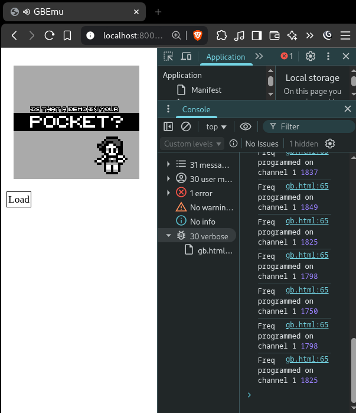

<!-- BEGIN ARISE ------------------------------
Title:: "Listen to your Game Boy with style"

Author:: "Dr. Schlange"
Description:: "Let's hack a Game Boy emulator sound system and listen to it on an external synth with Nallely"
Language:: "en"
Published Date:: "2025-10-10"
Modified Date:: "2025-10-10"

---- END ARISE \\ DO NOT MODIFY THIS LINE ---->

# Listen to your Game Boy with style

So, I wondered if it would be possible to listen to the Game Boy on my synths, and to orchestrate the different channels on different synths. Let's be clear, I'm not speaking about routing the sound of the Game Boy by channel to an external audio source, I'm speaking about decoding the notes that will be played by each channel and send them as MIDI note to an external synth connected via MIDI/USB-MIDI. As useless as it sound, well, it is useless, but it's also fun. A good way to add a small Game Boy demoscene rom browser to [Nallely](https://github.com/dr-schlange/nallely-midi) and play with the produces signals, or to play to Super Mario Land or Pokemon with style. In this article we will see go in the experiment of hacking an existing JavaScript Game Boy emulator to extract what we need and connect it to Nallely. All the capabilities of the GB are not exploited here. It's more a small PoC and a fun use case.

## Why JavaScript, why a Game Boy?

Ok, time for a small story, if you don't care about why, just skip this section, and if you only want to see the final result: [go to this section](#final-demo) for the final video and link toward the source code (I'll not be sad). While continuing to iterate on Nallely to meet what I have in mind - I'm still far from it... -  I realised that for quick experimentation, when I'm not working on the core of the system, I'm developing more and more small external modules in JavaScript. I'm really not a big fan of JS in general, I dislike a lot of things inside of it: at the language level, and the tooling level. However, I have to admit that for quick feedbacks and to be able to quickly use some devices, it's just amazing. It's trivial to gain access to the webcam, it's trivialish to gain access to the audio, it's easy to just script + reload while Nallely is still running, you have UI elements you can manipulate, and also, it distributes a part of the computation on another machine on the network. On top of this, most of the modern connected devices (phones, tablet, machine with UI) have a JS capable browser, so it's easy to make it work almost everywhere. The cherry on the cake is if you manage to have all in a single standalone HTML page: dependencies will load during the loading of the page, no installation, no command to run, so perfect for experimentations. This said, I'm open to change my mind on this, if you have simpler alternative, feel free to share!.

> By the way, hot reload in a Smalltalk fashion for pure Python modules (virtual devices in Nallely) will arrive soon, first steps are here. This will let you code directly to create, modify, and/or object-centric debug your Python device (threads) from TrevorUI in a running Nallely session without any need to reload, but shhhh, that's another story. Hopefully I'll be able to achieve the level of technical smoothness I have in mind, I still need to reflect more on this in term of usability, especially for mobile devices.

So, having external devices (I call the devices neurons) is practical. For example the oscilloscopes are coded as external devices. This way the browser receives information and takes the load of displaying them without disturbing a running Nallely session. One thing I totally forgot though is that few months ago I let the capabilities for them to not only receive information, but also to send information... You know, you do stuffs and you forget what you did... I know you'll argue, and you would be right: that's why documentation exists! I guess I forgot this feature as it was a way less big deal to implement compared to what I was expecting in the first place.
Anyway, so after having introduced some new widgets in TrevorUI, I realized that the widgets (scopes, pads, etc) are the only one that have a different specific UI compared to the other neurons, and for a good reasons. All the other neurons try to be as "the same" as possible as UI so they can be integrated in the system without any intervention. However, the widgets are built not from what they can do (a Python neuron could do the same), but they are built from what they could look like. Consequently, it's more a moment where you think about the UI and how you'll interact with it more than in pure CV signal processing. Knowing that, I thought that an game system emulator could be fun to play with. You can control it with the keyboard, so you could emulate button presses with LFOs, you could build strategies with shift registers, you could filter them in some cases, etc. Don't forget that playing with CV in a modular synth is like programming a small modular computer. On top of that, you might be able to get a signal from it, from the sound engine. You can use it as CV or as note sequences, to sum up, you can have a source material to build from using the notes of the sound engine. That's great! There is just one thing to do then, take an emulator and get the notes that are played by the emulator. That's all! So let's do it!

## Finding the right GB emulator

Having to hack into a GB emulator to get the notes that are played wasn't as easy as I was expecting. There is dozens of GB emulator developed in JS, but they all have different degree of maturity, and, believe it or not, but the trickiest part of the GB emulation is actually the sound on a timing point of view... My requirements for this PoC were, what I thought, simple:

1. the emulator have to be written in pure JS, no TypeScript, I don't want to have to compile nothing, I want a direct standalone file;
2. the emulator needs to have an API so I can at least access some parameters (registers, memory, ...);
3. the emulator needs to be accessible directly from online somewhere so there is nothing to install;
4. the emulator needs to have sound (that's the most complicated requirement apparently).

I browsed github looking for an emulator that would match my needs. There is a lot, but they really don't all have the same capabilities. After a dozen of pages, I found one that was partially meeting my requirements: [GemuBoi](https://github.com/danwsong/gemuboi-js) by [Daniel Song](https://danwsong.com/) (don't forget to give Daniel's GemuBoi repo a star!). The last commit wasn't a 100 years old, it's written in pure JS (no need to load WASM modules), a [demo page](https://gemuboi.danwsong.com/) loads it, the demo page is a pure single HTML page, and SOUND IS WORKING. Ok, not all is perfect compared to what I was looking for, the sound uses the WebAudio API and is sometimes laggish, but it doesn't require to have `SharedBufferArray` activated as other emulator I saw, so I can live with that. Others not so great parts:

* the emulator bootstrap is not super smooth, there is a bunch of functions we have to copy to make it boot from the PoC standalone HTML;
* there is no real API to control it from outside, but that's not a problem.

The points I enumerated are then not problematic, it's just a matter to write the first page, and then to monkey patch here and there.

## What's the idea then?

The idea is pretty straight forward. If we want the synth to play what the GB is playing, we need to know 2 things:

1. what note is played;
2. when the note is going to be played.

Then, once we have the note, we will translate it into its MIDI counterpart, and we will send it to the synth. The whole process is simply this one:

```bash
GB Emulator -[our patch]-> decode/store note -> when note is about to be played --> physical synth.
```

That's it, nothing else actually for a first PoC and first step, it will be enough. So the first part of the game is to read the emulator code and to see if we can actually hook ourselves in the right places. This means that we need to dig into the source code of the emulator and we need to understand how the sound it produced on the GB.

## Game Boy and sounds

There is countless article that gives a good overview about how the Audio Processing Unit (APU) of the GB works, but if I could recommend a set of 3 articles, it would be the ones from Niko Zurstraßen on [his website](https://www.chciken.com/) which are really cool and interactive. Specially we can see that the APU proposes 4 different channels:

* 1 [square channel](https://www.chciken.com/tlmboy/2025/03/28/gameboy-apu-square.html) with sweep;
* 1 square channel;
* 1 [wave channel](https://www.chciken.com/tlmboy/2025/04/22/gameboy-apu-wave.html);
* 1 [noise channe](https://www.chciken.com/tlmboy/2025/03/24/gameboy-apu-noise.html).

All those channels proposes a lot of control to be able to produce the iconic sound of the GB. For our purpose, we will only focus on the notes that are played, not on the envelope control, the sweep control, the volume, ... That's for another story.

How the APU works then? As for most computational unit, you would write to some register the information that you want the unit to process. For each channel, there is a set of registers that are used:

* `NR1x` for channel 1, and `NR14` which is the channel control register;
* `NR2x` for channel 2, and `NR24` which is the channel control register;
* `NR3x` for channel 3, and `NR34` which is the channel control register;
* `NR4x` for channel 4, and `NR44` which is the channel control register.

Those registers `NRx4` are the ones that will control if a note needs to be triggered. When the trigger-bit of the register is set, the sound is then "planned" to be played for later. That's cool, this is where we can hook ourselves. So let's review the emulator code and check how it's structured.

> I don't know about you, but I really enjoy reading code. It's a small story, sometimes it's well written, sometimes it's badly written, and sometimes it's just and amazing story. There is always something to extract from great stories, usually new ideas. It also helps to know where your own story needs to be developed and where it's perhaps unecessary. I like reading code.


Let's check the [`sound.js`](https://github.com/danwsong/gemuboi-js/blob/master/js/sound.js) module, that looks like a good lead to search for sound related stuffs. Let's focus on channel 1. The piece of code we are intersting in is related when something will be written in `NR14`.

```js
set nr14(value) {
    this.channel1Trigger = (value & 0x80) != 0;
    this.channel1LengthEnable = (value & 0x40) != 0;
    this.channel1Frequency = ((value & 0x7) << 8) | (this.channel1Frequency & 0xff);
}
```

That's awesome, we already have almost all we need! We have the `channel1Trigger` instance attribute that will be `true` if the channel needs to be triggered (a note will be played), we have the `channel1Frequency` instance attribute that is the actual frequency that needs to be played!

Ok, that was fast... Let's start to code something quickly to see if we are going in the right direction.


## The standalone HTML page

First things first, we have to create the standalone HTML page that will start our gameboy emulator. A brief look at the demo page shows that there is a bunch of js to load and a `main.js` file that starts the emulator by creating an instance of it. We want to have control over the instance creation possibly, so we will just copy/paste part of the `main.js` in our HTML. The page is not built to be beautiful or nothing, just to have something. I pasted the full code here in case you want to copy it to start your own experimentations on other aspects, or to follow more or less this article.


```js
<!DOCTYPE html>
<html>
<head>
  <title>GBEmu</title>
</head>
<body class="bg-light text-dark">
  <div style="display: flex; flex-direction: column;">
    <canvas id="canvas" class="d-block w-100"
      style="image-rendering: crisp-edges; image-rendering: pixelated; margin-left: -8px"></canvas>
    <label for="romFileInput" class="custom-file-upload"
      style="border: 1px solid black; padding: 2px; width: fit-content; margin-bottom: 4px; cursor: pointer; height: fit-content;">
      Load
    </label>
    <input id="romFileInput" type="file" accept=".gb, .gbc" style="display: none;">
  </div>

  <script src="https://gemuboi.danwsong.com/js/cpu.js"></script>
  <script src="https://gemuboi.danwsong.com/js/display.js"></script>
  <script src="https://gemuboi.danwsong.com/js/sound.js"></script>
  <script src="https://gemuboi.danwsong.com/js/timer.js"></script>
  <script src="https://gemuboi.danwsong.com/js/joypad.js"></script>
  <script src="https://gemuboi.danwsong.com/js/serial.js"></script>
  <script src="https://gemuboi.danwsong.com/js/cartridge.js"></script>
  <script src="https://gemuboi.danwsong.com/js/rtc.js"></script>

  <script>
    // main setup
    let gb;
    let cycles;
    let next;
    let paused = false;
    let running = false;

    function update() {
      if (paused || !running) {
        return;
      }
      if (gb.cartridge.hasRTC) {
        gb.cartridge.rtc.updateTime();
      }
      while (cycles < Display.cpuCyclesPerFrame) {
        try {
          cycles += gb.cycle();
        } catch (error) {
          console.error(error);
          running = false;
          return;
        }
      }
      cycles -= Display.cpuCyclesPerFrame;
      next += Display.frameInterval;
      setTimeout(update, next - performance.now());
    }

    function loadAndStart(rom) {
      gb = new GameBoy();

      try {
        gb.cartridge.load(rom);
        running = true;
        next = performance.now();
        cycles = 0;
        update();
      } catch (error) {
        console.error(error);
      }
    }

    addEventListener('beforeunload', () => {
      if (running) {
        gb.cartridge.save();
      }
    });

    document.addEventListener('visibilitychange', () => {
      if (running) {
        if (document.hidden) {
          paused = true;
        } else {
          paused = false;
          next = performance.now();
          update();
        }
      }
    });

    document.addEventListener('focus', () => {
      document.activeElement.blur();
    }, true);

    document.addEventListener('click', () => {
      if (Sound.ctx.state != 'running') {
        Sound.ctx.resume();
      }
    });

    const romFileInput = document.getElementById('romFileInput');
    romFileInput.addEventListener('change', () => {
      if (running) {
        gb.cartridge.save();
        running = false;
      }
      const reader = new FileReader();
      reader.addEventListener('load', () => {
        loadAndStart(new Uint8Array(reader.result));
      });
      reader.readAsArrayBuffer(romFileInput.files[0]);
    });
  </script>
</body>
</html>
```

We save and load the page and... well, that works, why it wouldn't, this is just HTML an JS an we know the demo page works. A small breakpoint on during the `GameBoy` instance creation shows that we retrieve well the instance.


## Let's hack into it

Now that we have our GB emulator running, we can start to play with it a little bit. As a first test, we can just try to see if, indeed, we get the frequency, and what the number stored in `channel1Frequency` actually represents. Hopefully we will have the frequency we need to "hear" and we can translate it to MIDI (spoiler, it's not the case). Anyway, we need to monkey patch the method and we will just insert a `console.debug` to see if we are in the right track. The best way to validate that we are actually in the right track will be "by hear". We will check that what we see on the screen is well linked to a note we hear. If we see numbers moving, but no variations in the sound, then... there is a problem. So let's monkey patch the `nr14()` method we found earlier and... arrrg that's an accessor. Nothing wrong with that, it's just that I never remember how to deal with those. I'm not doing enough JS I guess... I don't know, JS object model doesn't stick with me. Let's check again [the documentation about it](https://developer.mozilla.org/es/docs/Web/JavaScript/Reference/Functions/set#definiendo_un_setter_en_un_objecto_existente_usando_defineproperty). I linked the Spanish page, just because why not (there is obviously a button to change language in your favorite human language). Ok, now that we all remember how to defined a setter using `Object.definePropery(...)`, let's proceed with the code:

```js
const reg = Object.getOwnPropertyDescriptor(Object.getPrototypeOf(gb.sound), "nr14").set;
Object.defineProperty(gb.sound, "nr14", {
    set(value) {
        reg.call(this, value);
        if (this.channel1Trigger) { // we check if the channel was triggered
            console.debug("Freq programmed on channel 1", this.channel1Frequency)
        }
    }
});
```

We are first getting the original setter because we will call it from our replacement setter. We dig into the GB instance created and reach the sound instance using `gb.sound`. We then get the property descriptor for the `"nr14"` accessor and we target the `set` method from it. Once we have the original setter saved in `reg`, we replace the setter for `"nr14"` inside of `gb.sound` by a method that calls the original code, then we log if `channel1Trigger` is true.
We place this code directly after the `gb` instance creation:

```js
function loadAndStart(rom) {
    gb = new GameBoy();

    // The previous snippet is integrated just after the main instance creation
    const reg = Object.getOwnPropertyDescriptor(Object.getPrototypeOf(gb.sound), "nr14").set;
    Object.defineProperty(gb.sound, "nr14", {
        set(value) {
            reg.call(this, value);
            if (this.channel1Trigger) {
                console.debug("Freq programmed on channel 1", this.channel1Frequency)
            }
        }
    });

    try {
        gb.cartridge.load(rom);
        running = true;
        next = performance.now();
        cycles = 0;
        update();
    } catch (error) {
    console.error(error);
    }
}
```

Let's see if that works! We run this with the [is that a demo in your pocket](https://www.pouet.net/prod.php?which=65997) ROM.



So, we have something that looks more or less coherent with what we here in term of "happeningness". We have values and they sound more or less in sync with the sound coming from the emulator. That's a good start, no, a great start. However, we can see that the all the frequency are round values. That looks fishy, music note sound frequencies have often decimals, and here all is perfectly round, there is something going on. Let's have a look more in depth in what's said on the page for the square channels:

> The square channel uses a non-exposed, 11-bit counter that increases every time it is clocked. After 2047 it overflows, generates a signal, and is set to the value of NR13 and NR14. The resulting frequency is: 131,072/(2048-frequency). :o

That means that we need to translate the value that is in `channel1Frequency` to get the frequency. We modify then our method:

```js
Object.defineProperty(gb.sound, "nr14", {
    set(value) {
        reg.call(this, value);
        if (this.channel1Trigger) {
            const freqHz = 131072 / (2048 - this.channel1Frequency); // we computer the freq in Hz
            console.debug("Freq programmed on channel 1", freqHz)
        }
    }
});
```

Here what's we get:

```bash
...
Freq programmed on channel 1 587.7668161434977
Freq programmed on channel 1 524.288
Freq programmed on channel 1 587.7668161434977
Freq programmed on channel 1 621.1943127962086
...
```

That definitely looks more like musical frequencies. We are on good tracks. To confirm that, we will translate those frequencies to a MIDI note, and we will send them directly to the synth to test. To translate the frequency to a MIDI note, we need to apply [another formula](https://newt.phys.unsw.edu.au/jw/notes.html) and integrate it to the code of our method:

```js
const freqHz = 131072 / (2048 - this.channel1Frequency);
const midi = Math.round(12 * Math.log2(freqHz / 440) + 69);
console.debug("Freq programmed on channel 1", freqHz, midi)
```

And here is what we get:

```bash
...
Freq programmed on channel 1 439.83892617449663 69
Freq programmed on channel 1 524.288 72
Freq programmed on channel 1 587.7668161434977 74
...
```

That definitely looks decent! We just have to send it to a synth now.


## Integration with Nallely

Now that we have the emulator running, we need to integrate it with Nallely. The integration relies on websockets and the auto-registration of our emulator on the `WebsocketBus` that Nallely runs. The good thing is that there is a lib to help auto-register. We will use it, and we will register our service and see if registeres to Nallely. First, we load the lib by adding this line after the script tags for GemuBoi.

```html
<script src="https://cdn.jsdelivr.net/gh/dr-schlange/nallely-midi@main/libs/js/nallely-websocket.js"></script>
```

Then, we register the service by declaring the parameter that we will use:

```js
// Registers the emulator as a neuron in Nallely
const parameters = {
    ch1_freq: { min: 0, max: 127 },
    ch2_freq: { min: 0, max: 127 },
    ch3_freq: { min: 0, max: 127 },
    ch4_freq: { min: 0, max: 127 },
};

const config = {
    ch1_freq: 0,
    ch2_freq: 0,
    ch3_freq: 0,
    ch4_freq: 0,
};
const device = NallelyWebsocketBus.register('emulator', 'gb', parameters, config);
```

I'm so confident that I added the other channels. Let's now send the value for the channel and replace the infamous `console.debug(...)` we introduced earlier.

```js
 Object.defineProperty(gb.sound, "nr14", {
    set(value) {
        reg.call(this, value);
        if (this.channel1Trigger) {
            const freqHz = 131072 / (2048 - this.channel1Frequency);
            const midi = Math.round(12 * Math.log2(freqHz / 440) + 69);
            device.send("ch1_freq", midi);  // we send the value on the "ch1_freq" port
        }
    }
});
```

Now, let's start a Nallely session, connect to TrevorUI and refresh the page with our experimentation.

```bash
nallely run --with-trevor --serve-ui -b
```

The option `run --with-trevor` is to ensure that the Trevor protocol will be activated, and `--serve-ui` is to also get TrevorUI served by the running session. It's not an obligation, the UI could be served by any other server, it's just more practical here.
The `-b` option is to load the builtins MIDI devices (currently Korg Minilogue, Roland S1, Behringer JT4000, and Behringer ProVS mini). You can also add support for [your own MIDI device very easily](https://dr-schlange.github.io/nallely-midi/nallely-midi/posts/add-new-midi-device/). Once the session is running, and the UI is loaded, we can see that the GB emulator appears as neuron in Nallely with the parameters/ports we declared. I'll then create a Minilogue MIDI node, and patch the channel 1 to the Minilogue, add a scope to check if there is well something happening (in case there is no sound), and load the ROM. Finger crossed!

<div style="display: flex;flex-direction: column;align-items: center;">
  <iframe width="560" height="315" src="https://www.youtube.com/embed/biP7n-AvQjg?si=Om7pW2zofmuRJPrn" title="YouTube video player" frameborder="0" allow="accelerometer; autoplay; clipboard-write; encrypted-media; gyroscope; picture-in-picture; web-share" referrerpolicy="strict-origin-when-cross-origin" allowfullscreen></iframe>
  <p>We have a sound!</p>
</div>


That works! That's only channel 1, but that works! There is a problem though... We can hear that the sound of the synth is happening *before* the sound of the emulator... That's not soooo much of an issue when you cut the sound of the emulator, but that's not the best to have a synth that can see in the future compared to the presend of the running emulator. We need to find what's going on.


## Timing issues, why are we playing the future of the present?

If you remember what I wrote earlier, there is two components for the note to be played and for us to play it well. We need to get the note, ok, check, but then, we need to get "when" the note is played. That's another component. So we need to dig in the GemuBoi source code a little bit more. First, where is the sound actually going to be played? Writing to the `NR14` registry just triggers the "ready" flag for the channel, but doesn't trigger the sound really. In the code, we can see there is a [`Sound.latency`](https://github.com/danwsong/gemuboi-js/blob/master/js/sound.js#L648-L649) class variable as well as a `Sound.bufferDuration` class variable that sound (haha) interesting. The sound in emulator is not "real-time" as the APU would produce it as each frequencies have to be written to a buffer that will be played by the WebAudio API. Let's  then for which part of the code uses the `Sound.latency` variable. The `pushBuffer()` method uses it:

```js
pushBuffer() {
    const now = Sound.ctx.currentTime;  // here we have time related code
    const nowPlusDelay = now + Sound.latency;  // here also
    this.nextPush = this.nextPush || nowPlusDelay;  // here also
    if (this.nextPush >= now) {
        const bufferSource = Sound.ctx.createBufferSource();
        bufferSource.buffer = this.buffer;
        bufferSource.connect(this.gainNode);
        bufferSource.start(this.nextPush);
        this.nextPush += Sound.bufferDuration;

        this.buffer = Sound.ctx.createBuffer(2, Sound.bufferSamples, Sound.sampleFrequency);
        this.bufferLeft = this.buffer.getChannelData(0);
        this.bufferRight = this.buffer.getChannelData(1);
    } else {
        this.nextPush = nowPlusDelay;
    }
}
```

So the `pushBuffer()` method has some pretty darn good content here. We have `Sound.ctx.currentTime` that gives us the current WebAudio playback time, and `nowPlusDelay = now + Sound.latency` that schedules it slightly in the future. So in this method, the sound is still not produced, it's **scheduled for later**, this is what we miss!

So, let's modify our `NR14()` patch to include the same computation and let's program the send for the future of the present of the moment the patch will be called:

```js
const reg = Object.getOwnPropertyDescriptor(Object.getPrototypeOf(gb.sound), "nr14").set;
Object.defineProperty(gb.sound, "nr14", {
    set(value) {
        reg.call(this, value);

        // We mimic the code of the "pushBuffer"
        const now = Sound.ctx.currentTime;
        const nowPlusDelay = now + Sound.latency;
        const scheduledTime = this.nextPush || nowPlusDelay;

        if (this.channel1Trigger) {
            const freqHz = 131072 / (2048 - this.channel1Frequency);
            const midi = Math.round(12 * Math.log2(freqHz / 440) + 69);

            // We use it to program the send in the future
            setTimeout(() => {
                device.send(`ch1_freq`, midi)
            }, (scheduledTime - now + Sound.bufferDuration) * 1000);
        }
    }
});
```

We are computing the `scheduledTime` and we remove the `now` time from it to have a relative time. The time we have is in seconds, so we need to adjust that as ms multipying by `1000`. So, why do we need to remove the `now` and we don't just do a `Sound.latency * 1000`? Well, just because I'm not sure about what's going to happen because of the `this.nextPush || nowPlusDelay`. At this point, I just want the thing to work and I prefer to stay close from the original emulator code in case it doesn't fully work. It's better to go forward and see later if I can remove that. Honestly, I can live with that at the moment.

It's not the best as we are not modifying the `pushBuffer()` so we might have some few delay still going on, but I'm puting all my faith in the fact that JS is fast (I hear that all the time, so it has to be true). Let's do the same as we did before, reload the JS code, grab the ROM and compare. I didn't recorded this part out of lazyness and because it's not that important, what needs to be heard is that... we are still in the future... Slightly though, we are getting close! After a small rambling, I see that adding `10ms` solves the problem, like almost entirely! That's cool, but that's not acceptable... why 10ms? I don't like magic constants like this, it really ain't good. We need to get what's the problem. We take into account the latency and we use the code "we don't understand now" that performs the logical "or". This means that we are in sync with the code of the emulator. I really cannot think that there is almost 10ms of overhead passing from this method to the `pushBuffer` to the actual sound. That's pretty unlikely, so the problem is somewhere else. However, if we look closely to the `pushBuffer` method... We didn't take into account the duration of the buffer! If you saw it already, good catch! I totally missed it. So let's add it to the computation:

```js
Object.defineProperty(gb.sound, "nr14", {
    set(value) {
        reg.call(this, value);
        const now = Sound.ctx.currentTime;
        const nowPlusDelay = now + Sound.latency;
        const scheduledTime = this.nextPush || nowPlusDelay;

        if (this.channel1Trigger) {
            const freqHz = 131072 / (2048 - this.channel1Frequency);
            const midi = Math.round(12 * Math.log2(freqHz / 440) + 69);
            setTimeout(() => {
                device.send(`ch1_freq`, midi)
                // We schedule a little bit more in the future
                // so the synth present is the emulator present
                // and avoid the synth to be a deviner
            }, (scheduledTime - now + Sound.bufferDuration) * 1000);
        }
    }
});
```

<div style="display: flex;flex-direction: column;align-items: center;">
  <iframe width="560" height="315" src="https://www.youtube.com/embed/YLjFrCBGLes?si=mRwyYlW__XgyFQSe" title="And now for a test!" frameborder="0" allow="accelerometer; autoplay; clipboard-write; encrypted-media; gyroscope; picture-in-picture; web-share" referrerpolicy="strict-origin-when-cross-origin" allowfullscreen></iframe>
  <p>And now for a test!</p>
</div>

It works! We are perfectly in sync. Well, perfectly, perhaps not at the ns level, there is the websocket communication between the emulator and Nallely, then between Nallely and the synth, but it's not noticeable. Sound is coming out of the synth, I can play with it (as in the video where I'm toying with the filter). That's great! We have 1 channel, let do the same for all of the others. We will code ourselves a small patching function and we will call it where we had the patching code before:

```js
const patchChannelRegistry = (gb, register, channel, disablePreviousNote) => {
    const reg = Object.getOwnPropertyDescriptor(Object.getPrototypeOf(gb.sound), register).set;
    Object.defineProperty(gb.sound, register, {
    set(value) {
        reg.call(this, value);
        const now = Sound.ctx.currentTime;
        const nowPlusDelay = now + Sound.latency;

        const scheduledTime = this.nextPush || nowPlusDelay;
        if (this[`channel${channel}Trigger`]) {
            const freqHz = 131072 / (2048 - this[`channel${channel}Frequency`]);
            const midi = Math.round(69 + 12 * Math.log2(freqHz / 440));
            setTimeout(() => {
                device.send(`ch${channel}_freq`, midi)
            }, (scheduledTime - now + Sound.bufferDuration) * 1000);
        }
    },
    });
}

// ...
patchChannelRegistry(gb, "nr14", 1);
patchChannelRegistry(gb, "nr24", 2);
patchChannelRegistry(gb, "nr34", 3);
patchChannelRegistry(gb, "nr44", 4);
```

I could have written it better, we could have extracted the channel number from the register name. It's fine, it's explicit like this. After giving a try, something happened... All worked *except* the channel 4. Why channel 4 is not working? It should. Let's dig in this infamous channel.


## Channel 4, noisy and built different

How could we be so pollito to believe that we would have everything working so fast. Obviously something is going on with Channel 4. It's going to be a tough one, we're going to have to cheat I think... So, channel 4 is not about notes, it's a noise channel. It doesn't use a frequency divider the same say, it uses instead a [linear feedback shit register](https://www.chciken.com/tlmboy/2025/03/24/gameboy-apu-noise.html) (LSFR). If you know a little bit modular synthesis, you'll know what a shift register is. Basically, they use the shift register while flipping some bits to create a noise. When channel 4 is asked to play, it burst a noise burst. This channel is used for drums or percusive tracks, so the whole formulas for frequency and MIDI doesn't work there. Eventually, we want to have the channel passed as MIDI notes, so we will have to cheat.

Let's go back to GemuBoi source code. The `NR44()` setter is built differently from the others:

```js
set nr44(value) {
    this.channel4Trigger = (value & 0x80) != 0;
    this.channel4LengthEnable = (value & 0x40) != 0;
}
```

That's it? Nothing else? Not even a small `frequency` somewhere? With what we read about the channel, that's quite normal, but how will we fix that? We need to have a MIDI note at the end. In a way, the Game Boy thinks the burst of noise is a frequency, if we hear carefully, we can hear that there is a kind of "pitch" to the noise. It will play the burst of "random" (it's not really random) notes at a specific frequency. If it was only pure noise all the time, there will be no percusion really, no drum possible, so it has to have a kind of note in a way.

After reading multiple sources, here is what I understood (don't blindly trust me on that, verify to be sure I'm not mistaking). The APU's base frequency is in `524288Hz` (the GB has a system clock of roughly 4.194MHz and derives the noise clock by dividing it by 8), and it's the internal noise clock. The Game Boy will try to slow down this frequency to use it as "speed" of a burst of noise. A "value" (0 or 1) is produced by the LSFR, and those values are produced at a specific frequency. At the end, the noise is only a set of pseudo-random notes played at a specific speed. There is a fixed number of "speeds" that are used. To lower the frequency the GB then divides the base frequency (~524kHz) by a fixed division ratio.  The smallest division is `2` and the biggest is `28`. For the smallest division, dividing by `2` is nice, but it's still way too fast to have a noise frequency that is in the range of human hear. The APU is actually using then the shift information from the shift register (how many position we aked to shift) to divide more the base frequency. With that, we will get a frequency in the range of human hear. This is what interests us, we can find this frequency and consider it as a musical frequency instead of the speed of the burst of noises.

We need to find two informations then, the divisions for the base frequency, and how many position we shift. Again, we need to dig in the emulator source code. Quickly we can find the [`Sound.divisionRatios`](https://github.com/danwsong/gemuboi-js/blob/master/js/sound.js#L665C1-L665C21) the APU considers to shift the shift register, then if we search for `Sound.divisionRatios` in the source code, we find  [lines 571 to 574](https://github.com/danwsong/gemuboi-js/blob/master/js/sound.js#L571C12-L574C14):

```js
 while (this.channel4FrequencyCounter <= 0) {
    this.channel4FrequencyCounter += Sound.divisionRatios[this.channel4DivisionRatio] << this.channel4ShiftClockFrequency;
    this.genLFSR();
}
```

So we know that a shift is done using `channel4ShiftClockFrequency` and that `Sound.divisionRatios` gives the division ratio. If we look online for a good formula to have the noise burst frequency (I didn't came with it), we find:

```bash
Frequency = 524288 Hz / r / 2^(s+1)

r: division ratio
s: shift
```

With that, we have all we need! We have the formula, we have the different division ratios, we have the shift in `channel4ShiftClockFrequency`. We compute the frequency and we apply the MIDI note conversion also at the same time.

```js
const gbNoiseToMidi = (shiftClockFreq, divisionRatio) => {
    const div = Sound.divisionRatios[divisionRatio];
    if (div === undefined) return 0;
    const f_noise = 524288 / (div * Math.pow(2, shiftClockFreq + 1));
    const midi = 69 + 12 * Math.log2(f_noise / 440);
    return Math.max(0, Math.min(127, Math.round(midi))); // clamp to MIDI range
}
```

*Et voilà*, we transformed a noise to a MIDI note. To make it work, we patch now `NR44` more or less the same way we did for the other registers:

```js
const patchNoiseChannel = (gb, instr) => {
    const nr44 = Object.getOwnPropertyDescriptor(Object.getPrototypeOf(gb.sound), instr).set;
    Object.defineProperty(gb.sound, instr, {
    set(value) {
        nr44.call(this, value);
        const now = Sound.ctx.currentTime;
        const nowPlusDelay = now + Sound.latency;

        const scheduledTime = this.nextPush || nowPlusDelay;
        if (this.channel4Trigger) {
        const midi = gbNoiseToMidi(this.channel4ShiftClockFrequency, this.channel4DivisionRatio);  // the midi note computation is here

        setTimeout(() => {
            device.send("ch4_freq", midi)
        }, (scheduledTime - now + Sound.bufferDuration) * 1000);
        }
    },
    });
}

patchNoiseChannel(gb, "nr44")
```

Obviously, knowing that we are patching channel 4 it wasn't necessary to pass `nr44` as parameter, but it's to have a kind of symmetry with the other patch function calls. That's it to get something for the noise channel! That was fun, let's test it, but we need to see bigger in term of setup.

## Final demo

I'm so confident it will work that I'll use multiple synths, one for each channel, and I'll run Nallely from the Raspberry Pi (rpi5). Let's use exactly 4 synths then:

* a Korg Minilogue (we love it);
* a Roland S1;
* a Behringer JT4000 micro (I really like the sound, but the MIDI support is really not great);
* 1 Korg NTS1 (this one is monophonic).

I made a couple of tweaks also in the code: reading GemuBoi code, I identified also some easy places to use or patch to control the overall volume of the emulator as well as the colors palette for the 4 color layers and gamepad support. So I introduced ports to manipulate them. This is not detailed in the article, but you can find the [full code in Nallely's repository](https://github.com/dr-schlange/nallely-midi/blob/main/libs/js/gb.html). I also integrated the emulator inside of TrevorUI. It's not necessary to have it running there, as we seen before, but it's practical to have the modules and the emulator located in the same window for mobiles (and this demo).

I added also few modules for channel 3 (because why not). I passed channel 3 to a chord generator that is redirected to the 4 entries of a sequential switch to create an arpegio pattern. The sequential switch is triggered by a square LFO that is "synced" with channel 1 beat. It's not real sync, I gave to the LFO's sync port the flow of channel 1 and let the BPM estimation algo of the LFO do its work. I also used this LFO and 2 others to modulate the color palette of 3 of the different layers of GemuBoi. I added some pads to activate or pause some of the LFOs thread on demand, and I also let one of the LFOs that controls the color palette of one layer to control the cutoff of the Minilogue. That's all I had in mind, but as everything is dynamic, it's easy to add/remove modules and changes the patches at run time while the sound is produced and without having to pause or stop anything.

TrevorUI is launched on my laptop. The emulator will then run in the browser of my laptop and will send the channel information through websocket to the Nallely's session and, eventually, to the synths.

Now, let's try it! I embedded the video starting at 2min something, but you can rewind to see how it started. I didn't show how I patched everything though.

<div style="display: flex;flex-direction: column;align-items: center;">
  <iframe width="560" height="315" src="https://www.youtube.com/embed/3lP3cipBH9U?si=T3FyZ2m4k9JCqOLR&amp;start=148" title="A more complex setup this time" frameborder="0" allow="accelerometer; autoplay; clipboard-write; encrypted-media; gyroscope; picture-in-picture; web-share" referrerpolicy="strict-origin-when-cross-origin" allowfullscreen></iframe>
  <p>A more complex setup this time</p>
</div>

A quick note about this demo.

Three of the synths are "polyphonic", so why didn't use only 1? They can play multiple notes at once. You have some degre of liberty in their manipulation. Not everything is as maleable than with a full modular synth, but it's nice to see how far you can go with those.. Some of those "not so maleable" things are the oscillators. Even if they can play multiple notes at once, they don't let you assign a flow of notes to a single oscillator (there 2 for the Minilogue), and they all share then the same sound path (paraphonie). This means that redirecting the three non-noise channels to a single synth (Minilogue for example) could lead to notes colliding, i.e: a channel plays a sequence of notes and anothe channel plays another sequence with overlapping notes. In this case, some notes might be "cut" (a voice is stolen). The Minilogue as 4 notes polyphonie support, if you play a 5th note, one of the previous note is switched off. When you have the 3 channels redirected to it and playing at different speed, a channel might take "all the attention" of the Minilogue and some notes of the other channels might be not hear or cut.


## Conclusion

It super ain't pretty, but it's something. There is a couple of things that doesn't help with my final setup: I don't have drum machine, that would have helped, and the algo for cheating channel 4 is not the best. Another point to consider is all the articulation around the notes. In this PoC we only focused on the frequency, but there is more information to decode, as the envelope, the sweep lenght for channel 1, ... Having those parameters as port of our new device would have let us patched differently and help having a nicer tone.

Obviously, the ROM used have an impact on what's played and how it renders. I used a demo ROM at some point, and thoses usually pushes the APU a little bit, and they have really fast note variations for some effects. Putting all of them on the same synth, even in polyphonic mode doesn't give a perfect result as we discussed before with the voice stealing.

We have to take also into account the websocket small latency that might have an impact on the timing sometimes, but from what I observed, the websocket communication wasn't that impacted, perhaps in some occasion, but keep in mind that in the demo, there is the 4 channels producing sound all the time, and there is also 4 scopes that receive data without any pause, so the websocket bus in the Nallely's session is producing a lot of data. The CPU consumption was ok, between 5% and 11% for some peaks, the memory comsumption is around 45Mb.

As a quick extention to this work, I made some tests using the generic MIDI bridge neuron Nallely has to control VCV rack and make it play along with the 4 synths. Again, it works, and it's in "sync", but it would require more patching in VCV Rack to have something nice to the hear.

Anyway, it's fun to see where you can go in an afternoon and how far you can get by only having various independent threads sending flows of values (signals) to each others, and now there is a new kind of signals I can have integrated in Nallely and play with! That was kind of the point. The fact the emulator is in JS, I can run it from my phone. I usually have a Nallely session running on a raspberry pi 5 with the S1, the JT4000 micro attached, my headphones in bluetooth and I can move freely in the house, cooking or doing things while playing with the various modules and make unexpected music. Having the emulator running on the phone is not amazing though. It works well with firefox, but it's atrrrrocious with brave. I guess one of the next steps would be to use [little sound dj](https://www.littlesounddj.com/lsd/index.php) as pure sequencer.


## Bonus: a small window system in TrevorUI

Another point that is still a WIP, even if the GB emulator is integrated in TrevorUI this way, is the fact of having a small window system that would let you embedd your external JavaScript devices directly in TrevorUI without any dedicated react/whatever code. The idea would be to have a kind of content agnostic small window that will load as an iFrame the content of the external neuron. It will just share with the neuron different size: embedded, maximized, maximized-portrait, maximized-landscape, external. Depending on the passed size, the UI part could adapt, possiblity with a better view, or better controls. That's just an idea right now, nothing amazing though. I need to reflect more on it.