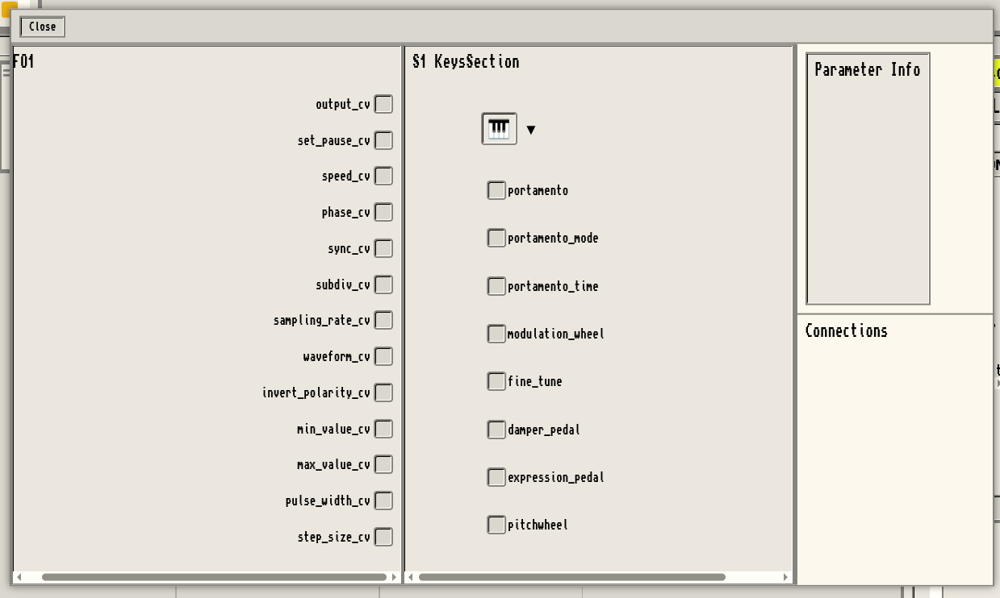
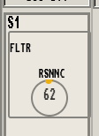

# Trevor UI

Trevor-UI is the embedded graphical user interface that relies on Trevor, the protocol to communicate with a running Nallely session. Trevor-UI is a webapp coded in Typescript with React.

This document describes and explains how to use Trevor-UI when a Nallely session is running.

## Overview

Trevor UI communicates with a small Trevor server that exposes the API to interact with a running Nallely session. The `Nallely Session` and the `Trevor Server` lives in the `Host Machine`. This machine is also the one which is connected to the various `MIDI Devices` you want to interact with. The Trevor UI however is living in your browser and can be served by any webserver. Once the webapp is served (consider "loaded in the browser"), your browser takes the lead and executes the app.

Trevor UI then is in charged of two things:

1. render the state of a Nallely session
2. send commands to the Nallely session through the Trevor Server.

When Trevor UI first connects to the Trevor Server, the server will send it the full state of the running Nallely session in JSON. Trevor UI will then gives a graphical representation of JSON state and any action that you'll do through the UI and that needs to have an impact on the Nallely session (e.g: create a new virtual device, change parameter values, ...) will send a command to the Trevor Server that will impact the Nallely session accordingly. After a commands have been successfuly executed, the Trevor Server sends the new state of the Nallely session for the UI to update itself consequently. All communication between the Trevor UI and the Trevor Server uses websockets.


## How to launch Trevor UI

There is multiple ways of starting Trevor UI, as it can be served from any machine. In this section we will only refer to the version that is embedded with a specific version of Nallely, which is the simplest was of serving Trevor UI.

The Nallely subcommand `run` proposes two different options to let you easily activates the Trevor Server and serve Trevor UI directly from the host machine:

* `--with-trevor` which launches the Trevor Websocket Server;
* `--serve-ui` which launches a small embedded webserver that serves the Trevor UI webapp.

Launching a simple Nallely session becomes then:

```
nallely run --with-trevor --serve-ui
```

If you want to add basic configurations for builtins MIDI devices, you can pass the option `-b`:

```
nallely run --with-trevor --serve-ui -b
```

If you want to add your own configuration for other MIDI devices, use the option `-l` with the path towards the configuration scripts. This example will load the config `configs/roland_s1.py` and all the scripts in `others`:

```
nallely run --with-trevor --serve-ui -l configs/roland_s1.py others/*.py
```

**NOTE:** find more information about how to generate the configuration for your own MIDI device in [this tutorial](https://dr-schlange.github.io/nallely-midi/posts/add-new-midi-device/).

Once you launch one of the commands to run the server, you should be welcomed with this prompt:

```
Trevor-UI running on http://localhost:3000 or http://127.0.0.1:3000...

Press 'q' to stop the script, press enter to display infos, press ? to display menu...
>
```

The command line tells us that Trevor UI is served from `http://localhost:3000`. If you want to use the same machine that serves the Nallely session and Trevor to get the UI, you can just open a browser on the same machine and navigates to http://localhost:3000. However, if you want to access Trevor UI from another machine, lets say from your phone, you have to know the IP address of the host machine on your local network.

In the following sections and screenshots, Trevor UI is served from `http://192.168.1.67:3000` (the address of the machine that serves the UI in my local network)

## Trevor UI - first connection, configuration (if needed)

The first time you connect to Trevor UI, you'll be greeted by a popup inviting you to check if Trevor UI is well connected to the Trevor Server and to configure the Trevor Server address if it's not the case.


By default, Trevor UI is configured to be connected to the machine that serves it. If you served Trevor UI from the command line using `--serve-ui`, then the Trevor Server address should be correctly set, and you should see the green icon `🟢` in the top right of the screen.


### Manually configure the Trevor Server address

If you served the UI from another machine, the addresse of the Trevor Server might then not be the right one, and you'll need to configure it manually by cliking on the `⚙` that appears on the top right of your screen. This will open a small modal asking for you to manually set the address and port. Usually, the port and protocol should remain the same: `ws://` for the protocol and `:6788` for the port, only the address part should change.


## Trevor UI - main window

The main window is split in 3 main zones:

1. the rack zone, this zone contains 3 different racks:
   1. a rack for MIDI devices (your MIDI devices you want to connect to),
   2. a rack for virtual devices (LFOs, EG, Clocks, ...)
   3. a rack for widgets, at the moment, mainly oscilloscopes (1D, 2D and 3D oscilloscopes)
2. the MIDI input/output zone, which is the zone where you can assign your MIDI devices to a specific MIDI port of the Host Machine
3. the settings panel which is used to set parameters value, depending on the device you want to tune.


In the rack zone, each rack has a small menu on top that lets you create instances of the devices related to their category.

| MIDI device selection |  Virtual Device selection |
:-------------------------:|:-------------------------:
 | 

When a device is created, a unified graphical representation is displayed in the related rack.


On the graphical representation, each orange square represents either:

* a section of the MIDI device;
* a parameter/port of the virtual device.

Depending on the device you then click on, settings that can be tweaked will be displayed in the settings panel. The following screenshot shows the settings that you can alter for an LFO

| Roland S1 settings |  LFO settings |
:-------------------------:|:-------------------------:
 | 


When you create a MIDI device, Nallely will try its best to find the right MIDI port for it. However, depending on how you connected your devices to your host machine, that's something that might not be possible. In this case, you need to manually assign the MIDI I/O to the MIDI device you created. To do that, you need to click on the `MIDI IOs` button in the top of your screen to expand the MIDI port selection section. When expanded, the zone shows you the various ports that are known by Nallely, and the MIDI devices that are represented.


To select a channel, you just have to click on input or output port, then your MIDI device. In this example, the Roland S1 is associated to the Scarlett MIDI ports.


## Trevor UI - patch your devices

Once you have your MIDI and virtual devices, you can start patching your devices. To do so, you need to click on the sections/ports you want to connect together. Once you do that, a modal will appear listing all the ports known in the section/device you selected. You can then click on the source port, then on the target port you want to patch together.



You are not limited in what you want to patch:

* you can patch ports from a MIDI device section to another one,
* you can patch ports from a virtual device to a MIDI device,
* you can patch ports from a MIDI device section to a virtual device port,
* you can patch ports form a virtual device to port of the same or other virtual device.

Here, we connected the output of the LFO to the notes of the Roland S1, and to the pitchwheel.


If you click on the connection in the bottow right of the modal, you can fine tune the connection by adapting its range, and the method it will use to scale the data to the target port.


In this modal, we patched the frequency button from the Roland S1 to the speed of the LFO, the LFO output to the resonance of the Roland S1 filter, and the frequency button of the Roland S1 to its own LFO depth.


The main windows then reflects at coarse grain the patches that you established.


As soon as you connect a device that sends information to a MIDI device, Nallely tracks the changes and display the tracked values in real-time in the CC panel (in the left of the racks zone) when they changes.



Those CCs displayed are not only visual feedback, you can also manually send values from Trevor UI this way. The default behavior is to only set and display informations that are "moving" or that have been touched at least once. If you want to see all the known parameters in this panel, you can activate the `see all` button, that displays all the known ports/parameter of the MIDI device and let you tweak the buttons if you need. Note that the interaction is mainly thought for mobile, you can touch + slide up or down to change the value.


In a general note, all the fields in the settings for the virtual devices are also "touch friendly", meaning that you can change them by touch + sliding up or down. For parameters that have a specific known range, the slide behavior will never go over the specified range. If you want to go over, you can manually enter the value with your keyboard.
